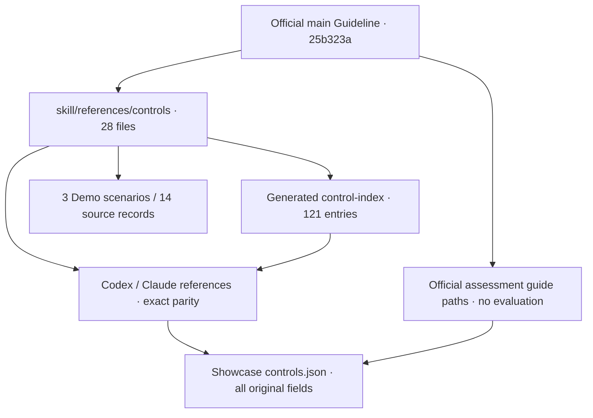

# GapZer0 Guideline → AI Skill Sync Report

## Source of Truth / approval basis

- Canonical source: official `origin/main` tree, `_pages/control-guide/` at `25b323acee87af4cb9a4d4dbca9708834069127e`.
- Working branch: `work/ai-skill-quant-eval-v2-young-eon`; HEAD `f80d34e2de79486ed31cf67a507b8c1664a788cf` remains unchanged.
- Latest remote main was queried before analysis and again at final review; both returned the same pinned SHA. The worktree Guideline is older and was intentionally left unchanged. No merge/reset/rebase/checkout was used.
- Main history includes the reviewed Domain PR merges and later `c41cbe0` (document/assessment design), `1bccb1e` (Korean prose), `472a1f4` (Stakeholder role clarification). This report uses the official main tree as the operational source. It does not assert that separate individual approval/sign-off documents were obtained.
- Official supplementary sources: `_pages/01-introduction.md`, `_pages/03-term-explanation.md`, and `assets/assessment/controls.json` from the same pinned tree.

## Quantitative structural comparison

| Item | Measured value |
|---|---:|
| Canonical source files | 28 |
| Guideline Controls | 121 |
| Skill before / after | 121 / 121 |
| Domains | 15 |
| Complete field matches before | 0 |
| Changed Controls | 121 |
| Complete field matches after | 121 |
| Changed field values | 220 |
| Added / deleted / renamed IDs | 0 / 0 / 0 |
| Name / Domain / Class / source-path changes | 0 / 0 / 0 / 0 |
| Evidence changes | 11 |
| Index applicability summaries changed | 3 |
| Index keyword changes | 0 |
| Unresolved structural conflicts | 0 |

A “changed field” is one Control-field value differing after line-ending/separator normalization. Cosmetic wording changes still count; this is not a count of new security obligations. All source fields, including applicability, mapping, CSF Coverage and ISMS-P Limitation, were compared.

### A–J classification

| Category | Meaning | Controls |
|---|---|---:|
| A | 완전 일치 | 0 |
| B | 문구 변경 | 121 |
| C | 필드 추가/삭제 등 구조 변경 | 0 |
| D | Control 추가 | 0 |
| E | Control 삭제 | 0 |
| F | Control ID 변경 | 0 |
| G | Domain/Class 변경 | 0 |
| H | Evidence 변경 | 11 |
| I | Source path 변경 | 0 |
| J | 구조적 충돌 / 확인 필요 | 0 |

Categories overlap (e.g. B and H); they must not be summed as independent Controls. Existing same-ID Controls were compared directly; no ID renames were inferred from similar text.

### Field changes

| Field | Controls with changed value |
|---|---:|
| Control Objective | 13 |
| Control Statement | 61 |
| Stakeholders | 80 |
| Implementation Guide | 27 |
| Evidence | 11 |
| CSF Coverage | 10 |
| Control Owner | 1 |
| ISMS-P Limitation | 4 |
| 매핑된 ISMS-P 항목 | 6 |
| 적용 조건 | 7 |

Full old/new values, canonical source path and applied flag for every Control are in [GUIDELINE_SKILL_STRUCTURAL_DIFF.json](GUIDELINE_SKILL_STRUCTURAL_DIFF.json). They are not AI summaries.

### Before comparison across consumers

| Target | Count | Changed against canonical fields | IDs preserved |
|---|---:|---:|---|
| `skill/references/controls/` | 121 | 121 | True |
| `.codex/skills/gapzero-guide/references/controls/` | 121 | 121 | True |
| `claude-skill/references/controls/` | 121 | 121 | True |
| `ai-skill-ui/data/controls.json` | 121 | 121 | True |

### Specific findings / semantic preservation

- Six ISMS-P mapping labels changed in the canonical source (`IEM-C-04`, `IEM-C-06`, `IEM-E-04`, `PHY-C-02`, `SCF-C-02`, `SNS-C-01`). The original uses “Control” in some former “통제” labels. We copied these literal labels and did not correct or reinterpret the official mapping. All mapping numbers remain identical.
- Official Assessment JSON has 93 case-only Domain label differences (e.g. `Asset management` vs `Asset Management`). The comparison verifies equality under case folding only for this display label; canonical Control Domain values are preserved exactly. There are no Name/Class/ID identity conflicts. The official `.guide` paths/anchors are stored as `assessmentGuide`; no assessment results were created.
- Index applicability summaries changed only for `ISA-C-01`, `ISA-C-02`, `LCM-L-02`, by the existing generator from canonical applicability. Keywords are unchanged; no test-target synonyms or ID boosts were added.
- Official terms define `Control Statement` as the core requirements and `Control Owner` as the responsible department/role. These two explanatory definitions were copied into Framework overview and both packages. They are separate from the 220 Control-field changes.
- No SKILL.md behavior rules, output-format rules or Runtime adapter were altered. No new Control/Evidence/legal duty/period/deadline/department/approval criterion or assessment result was invented.

## Source → generated data traceability



- `guideline-provenance.json`: pinned canonical revision, raw source SHA-256, cleaned mirror SHA-256, generated Index SHA, Assessment source/hash. The same manifest is included in both packages.
- `controls.json`: each Control has canonical `guidelineSource`/`guidelineRevision`, copied original fields/raw block, Skill path/source hash, keywords and the existing official `assessmentGuide`.
- Canonical mirror processing removes only Jekyll front matter and file-edge whitespace. Complete Control bodies are otherwise preserved. ID, fields and source anchors are validated exhaustively.
- Generic data builder / validator use the recorded pinned Git revision rather than older local `_pages/` when provenance is present. The branch/site/workflow remains untouched.
- Explorer source links point to the actual canonical main revision. Newly generated local reports/metric evidence use local links. Package artifact GitHub links still identify the old committed baseline until an authorized future commit/push.

## Demo revalidation

| Demo | Control records | Changed field values in these records | Latest source copied | Browser behavior |
|---|---:|---:|---|---|
| guide | 4 | 11 | PASS | PASS |
| plan | 1 | 1 | PASS | PASS |
| document | 9 | 11 | PASS | PASS |

Questions, modes and Control selection are unchanged. Updated Stakeholders, Objective/Statement/Implementation/Evidence/mapping wording are copied from the canonical source. Browser PASS checks static Demo behavior; they are not live LLM answers.

## Search re-execution

| Metric | Before | After |
|---|---:|---:|
| top3 | 7/8 (87.5%) | 7/8 (87.5%) |
| top5 | 8/8 (100.0%) | 8/8 (100.0%) |
| hit3 | 10/11 (90.9%) | 10/11 (90.9%) |
| hit5 | 11/11 (100.0%) | 11/11 (100.0%) |

- After command: `node skill/scripts/test-control-search.mjs`; actual exit code 0.
- Before: identical unchanged script executed in a temporary directory against the captured pre-sync Index; actual exit code 0. It is not a value assumed from a historical report.
- Existing uncommitted search algorithm changes predate this task and are byte-for-byte preserved. No ID-specific logic, new search algorithm or test expectations were added.
- HRS-C-01 after: rank 4, score 29.6031; still not Top-3, found Top-5. All eight case ranks/scores remain unchanged.

| Query | Before Top-5 | After Top-5 |
|---|---|---|
| 퇴사자 접근권한 권한 회수 | IAM-C-03(64.1603), IAM-C-01(44.7709), PHY-C-02(36.8903), HRS-C-01(29.6031), GOV-C-10(6.3298) | IAM-C-03(64.1603), IAM-C-01(44.7709), PHY-C-02(36.8903), HRS-C-01(29.6031), GOV-C-10(6.3298) |
| 개인정보 국외이전 해외 SaaS | LCM-L-09(22.7087), INF-L-01(2.658), INF-L-03(2.658), LCM-L-01(2.658), LCM-L-03(2.658) | LCM-L-09(22.7087), INF-L-01(2.658), INF-L-03(2.658), LCM-L-01(2.658), LCM-L-03(2.658) |
| 비인가 소프트웨어 설치 실행 | SCF-C-02(92.7309), PHY-C-01(18.9167), IEM-C-06(13.0777), AST-C-02(9.0255), PHY-L-01(8.1557) | SCF-C-02(92.7309), PHY-C-01(18.9167), IEM-C-06(13.0777), AST-C-02(9.0255), PHY-L-01(8.1557) |
| 취약점 위험 우선순위 조치 | TVM-C-04(48.8125), TVM-C-05(19.652), ISA-C-01(11.4092), TVM-C-01(11.3072), TVM-C-03(11.3072) | TVM-C-04(48.8125), TVM-C-05(19.652), ISA-C-01(11.4092), TVM-C-01(11.3072), TVM-C-03(11.3072) |
| 공급자 계약 보안 요구사항 | LCM-E-01(51.2034), SUP-C-05(41.0957), AST-C-03(25.1316), SUP-E-03(15.9395), SUP-C-08(14.4721) | LCM-E-01(51.2034), SUP-C-05(41.0957), AST-C-03(25.1316), SUP-E-03(15.9395), SUP-C-08(14.4721) |
| 공급자 관계 체결 전 실사 | SUP-C-06(93.1506), SUP-E-03(14.1298), SUP-C-08(13.3109), GOV-E-03(8.0241), SUP-E-02(6.7035) | SUP-C-06(93.1506), SUP-E-03(14.1298), SUP-C-08(13.3109), GOV-E-03(8.0241), SUP-E-02(6.7035) |
| 공급자 관계 종료 보안조치 | SUP-C-08(83.3521), SUP-E-03(23.0413), SUP-C-06(12.4359), CON-E-03(8.5178), GOV-E-03(8.0241) | SUP-C-08(83.3521), SUP-E-03(23.0413), SUP-C-06(12.4359), CON-E-03(8.5178), GOV-E-03(8.0241) |
| 백업 복구시험 복원 | CON-E-02(35.5772), CON-C-01(33.5631), CON-C-02(33.4298), CON-C-07(25.1406), CON-E-03(21.7653) | CON-E-02(35.5772), CON-C-01(33.5631), CON-C-02(33.4298), CON-C-07(25.1406), CON-E-03(21.7653) |

Actual command output / exit codes / metric evidence: [guideline-sync.json](../data/guideline-sync.json). Dashboard search cards now source this new measured result, not an old hardcoded percentage.

## Executed validation results

| Check | PASS / target | FAIL | Execution type |
|---|---:|---:|---|
| Control data validator | PASS | 0 | Static / pinned canonical source |
| Codex package sync validator | 34 files synchronized | 0 | Static, not Codex Runtime |
| Claude package validator | 33 reference files verified | 0 | Static, not Claude Runtime |
| Exhaustive Sync validator | 18/18 | 0 | Static data/package/traceability |
| ui | 10/10 | 0 | Local Chromium |
| ux | 12/12 | 0 | Local Chromium |
| readability | 13/13 | 0 | Local Chromium |
| showcase | 30/30 | 0 | Local Chromium |
| quantitative | 32/32 | 0 | Local Chromium |
| guideline-sync | 6/6 | 0 | Local Chromium |

Commands executed from repository root:

```bash
node skill/scripts/validate-control-data.mjs
node skill/scripts/validate-codex-skill.mjs
python claude-skill/tests/validate_port.py
PYTHONDONTWRITEBYTECODE=1 python skill/scripts/validate-guideline-sync.py
node skill/scripts/test-control-search.mjs
python -m http.server 8946 --bind 127.0.0.1
export UI_URL=http://127.0.0.1:8946/ai-skill-ui/
export UX_BASELINE=/tmp/guideline-sync-ui-baseline.json
node ai-skill-ui/tests/ui-tests.cjs
node ai-skill-ui/tests/ux-tests.cjs
node ai-skill-ui/tests/readability-tests.cjs
node ai-skill-ui/tests/showcase-tests.cjs
python ai-skill-ui/build-quantitative.py
node ai-skill-ui/tests/quantitative-tests.cjs
node ai-skill-ui/tests/guideline-sync-tests.cjs
```

### Intermediate failures and correction

The first SHOW run produced 28/30: SHOW26 still asserted “synchronization not performed”, and SHOW30 used a UI-phase baseline captured before the final allowed validator update. SHOW26 was changed only to assert the actual synchronized snapshot status; other functional assertions and the 30-test count are unchanged. UI baseline was recaptured after authorized data/package/script synchronization. The complete SHOW suite then passed 30/30. No Control data, expected search set or Runtime result was changed to force a PASS.

The old UI-only guard now measures the browser test phase after synchronization. It must not be interpreted as zero Skill changes for the entire task. SYNC17 separately compares the true task-start snapshot and enforces all four allowed directories, original Guideline protection, and unchanged pre-existing search code.

### Not executed / not claimed

- Actual external Codex and Claude Web Runtime re-execution: NOT RUN. Existing 13/13 and 3/3 remain historical records, explicitly labeled on the UI. Static package PASS is not Runtime PASS.
- T05/T06 live behavioral re-execution: NOT RUN. Static validators check the fake ID is absent and behavior rules are preserved; historical 0/1 observations are not expanded to a global safety claim.
- ISMS-P certification/legal compliance determination, real assessment storage/evaluation, production S3/API/UI, current public deployment: NOT VERIFIED in this task.

## Files / protection / repository state

- Original Guideline `_pages/`, existing site/assets, navigation, `_config.yml`, workflows, tests outside the four allowed trees: no task changes.
- Allowed trees: `skill/`, `.codex/skills/gapzero-guide/`, `claude-skill/`, `ai-skill-ui/` only.
- Main/site branch, current HEAD and existing search script: preserved. No commit/push/deploy.
- [Desktop sync status](guideline-sync-desktop.png), [Mobile sync status](guideline-sync-mobile.png).

### Changed-file manifest

Full paths below compare against the task-start SHA snapshot. Generated browser screenshots are included; the already-dirty search script is excluded because it did not change during this task.

| Allowed tree | Changed files |
|---|---:|
| `skill/` | 36 |
| `.codex/skills/gapzero-guide/` | 31 |
| `claude-skill/` | 33 |
| `ai-skill-ui/` | 45 |

- `.codex/skills/gapzero-guide/references/control-index.md`
- `.codex/skills/gapzero-guide/references/controls/01-governance/common.md`
- `.codex/skills/gapzero-guide/references/controls/01-governance/enhancement.md`
- `.codex/skills/gapzero-guide/references/controls/02-asset-management/common.md`
- `.codex/skills/gapzero-guide/references/controls/02-asset-management/enhancement.md`
- `.codex/skills/gapzero-guide/references/controls/03-continuity/common.md`
- `.codex/skills/gapzero-guide/references/controls/03-continuity/enhancement.md`
- `.codex/skills/gapzero-guide/references/controls/04-human-resource-security/common.md`
- `.codex/skills/gapzero-guide/references/controls/05-identity-access-management/common.md`
- `.codex/skills/gapzero-guide/references/controls/05-identity-access-management/enhancement.md`
- `.codex/skills/gapzero-guide/references/controls/05-identity-access-management/local.md`
- `.codex/skills/gapzero-guide/references/controls/06-information-protection/common.md`
- `.codex/skills/gapzero-guide/references/controls/06-information-protection/enhancement.md`
- `.codex/skills/gapzero-guide/references/controls/06-information-protection/local.md`
- `.codex/skills/gapzero-guide/references/controls/07-information-security-assurance/common.md`
- `.codex/skills/gapzero-guide/references/controls/08-information-security-event-management/common.md`
- `.codex/skills/gapzero-guide/references/controls/08-information-security-event-management/enhancement.md`
- `.codex/skills/gapzero-guide/references/controls/09-legal-compliance/enhancement.md`
- `.codex/skills/gapzero-guide/references/controls/09-legal-compliance/local.md`
- `.codex/skills/gapzero-guide/references/controls/10-physical-security/common.md`
- `.codex/skills/gapzero-guide/references/controls/10-physical-security/local.md`
- `.codex/skills/gapzero-guide/references/controls/11-application-security/enhancement.md`
- `.codex/skills/gapzero-guide/references/controls/12-secure-configuration/common.md`
- `.codex/skills/gapzero-guide/references/controls/13-supplier-relationships-security/common.md`
- `.codex/skills/gapzero-guide/references/controls/13-supplier-relationships-security/enhancement.md`
- `.codex/skills/gapzero-guide/references/controls/13-supplier-relationships-security/local.md`
- `.codex/skills/gapzero-guide/references/controls/14-system-network-security/common.md`
- `.codex/skills/gapzero-guide/references/controls/15-threat-vulnerability-management/common.md`
- `.codex/skills/gapzero-guide/references/controls/15-threat-vulnerability-management/enhancement.md`
- `.codex/skills/gapzero-guide/references/framework-overview.md`
- `.codex/skills/gapzero-guide/references/guideline-provenance.json`
- `ai-skill-ui/README.md`
- `ai-skill-ui/build-quantitative.py`
- `ai-skill-ui/build-showcase.py`
- `ai-skill-ui/build-sync-data.py`
- `ai-skill-ui/data/controls.json`
- `ai-skill-ui/data/guideline-sync.json`
- `ai-skill-ui/data/quantitative.json`
- `ai-skill-ui/data/showcase.json`
- `ai-skill-ui/demo-data.json`
- `ai-skill-ui/index.html`
- `ai-skill-ui/quantitative.js`
- `ai-skill-ui/showcase.js`
- `ai-skill-ui/sources/con-c-01.html`
- `ai-skill-ui/sources/hrs-c-01.html`
- `ai-skill-ui/sources/iam-c-01.html`
- `ai-skill-ui/sources/iam-c-03.html`
- `ai-skill-ui/sources/phy-c-02.html`
- `ai-skill-ui/sources/sup-c-02.html`
- `ai-skill-ui/sources/sup-c-03.html`
- `ai-skill-ui/sources/sup-c-04.html`
- `ai-skill-ui/sources/sup-c-05.html`
- `ai-skill-ui/sources/sup-c-06.html`
- `ai-skill-ui/sources/sup-c-07.html`
- `ai-skill-ui/sources/sup-c-08.html`
- `ai-skill-ui/sources/sup-e-02.html`
- `ai-skill-ui/sources/sup-e-05.html`
- `ai-skill-ui/tests/GUIDELINE_SKILL_STRUCTURAL_DIFF.json`
- `ai-skill-ui/tests/GUIDELINE_SKILL_SYNC_REPORT.md`
- `ai-skill-ui/tests/guideline-sync-desktop.png`
- `ai-skill-ui/tests/guideline-sync-mobile.png`
- `ai-skill-ui/tests/guideline-sync-test-results.json`
- `ai-skill-ui/tests/guideline-sync-tests.cjs`
- `ai-skill-ui/tests/main-screen.png`
- `ai-skill-ui/tests/quantitative-charts-mobile.png`
- `ai-skill-ui/tests/quantitative-dashboard-desktop.png`
- `ai-skill-ui/tests/quantitative-explorer-desktop.png`
- `ai-skill-ui/tests/quantitative-main-desktop.png`
- `ai-skill-ui/tests/quantitative-mobile.png`
- `ai-skill-ui/tests/readability-mobile.png`
- `ai-skill-ui/tests/showcase-explorer-desktop.png`
- `ai-skill-ui/tests/showcase-explorer-mobile.png`
- `ai-skill-ui/tests/showcase-tests.cjs`
- `ai-skill-ui/tests/showcase-validation-desktop.png`
- `ai-skill-ui/tests/ux-main-mobile.png`
- `ai-skill-ui/tests/ux-result-desktop.png`
- `claude-skill/references/control-index.md`
- `claude-skill/references/controls/01-governance/common.md`
- `claude-skill/references/controls/01-governance/enhancement.md`
- `claude-skill/references/controls/02-asset-management/common.md`
- `claude-skill/references/controls/02-asset-management/enhancement.md`
- `claude-skill/references/controls/03-continuity/common.md`
- `claude-skill/references/controls/03-continuity/enhancement.md`
- `claude-skill/references/controls/04-human-resource-security/common.md`
- `claude-skill/references/controls/05-identity-access-management/common.md`
- `claude-skill/references/controls/05-identity-access-management/enhancement.md`
- `claude-skill/references/controls/05-identity-access-management/local.md`
- `claude-skill/references/controls/06-information-protection/common.md`
- `claude-skill/references/controls/06-information-protection/enhancement.md`
- `claude-skill/references/controls/06-information-protection/local.md`
- `claude-skill/references/controls/07-information-security-assurance/common.md`
- `claude-skill/references/controls/08-information-security-event-management/common.md`
- `claude-skill/references/controls/08-information-security-event-management/enhancement.md`
- `claude-skill/references/controls/09-legal-compliance/enhancement.md`
- `claude-skill/references/controls/09-legal-compliance/local.md`
- `claude-skill/references/controls/10-physical-security/common.md`
- `claude-skill/references/controls/10-physical-security/local.md`
- `claude-skill/references/controls/11-application-security/enhancement.md`
- `claude-skill/references/controls/12-secure-configuration/common.md`
- `claude-skill/references/controls/13-supplier-relationships-security/common.md`
- `claude-skill/references/controls/13-supplier-relationships-security/enhancement.md`
- `claude-skill/references/controls/13-supplier-relationships-security/local.md`
- `claude-skill/references/controls/14-system-network-security/common.md`
- `claude-skill/references/controls/15-threat-vulnerability-management/common.md`
- `claude-skill/references/controls/15-threat-vulnerability-management/enhancement.md`
- `claude-skill/references/framework-overview.md`
- `claude-skill/references/guideline-provenance.json`
- `claude-skill/tests/source-manifest.json`
- `claude-skill/tests/static-validation-results.json`
- `skill/references/control-index.md`
- `skill/references/controls/01-governance/common.md`
- `skill/references/controls/01-governance/enhancement.md`
- `skill/references/controls/02-asset-management/common.md`
- `skill/references/controls/02-asset-management/enhancement.md`
- `skill/references/controls/03-continuity/common.md`
- `skill/references/controls/03-continuity/enhancement.md`
- `skill/references/controls/04-human-resource-security/common.md`
- `skill/references/controls/05-identity-access-management/common.md`
- `skill/references/controls/05-identity-access-management/enhancement.md`
- `skill/references/controls/05-identity-access-management/local.md`
- `skill/references/controls/06-information-protection/common.md`
- `skill/references/controls/06-information-protection/enhancement.md`
- `skill/references/controls/06-information-protection/local.md`
- `skill/references/controls/07-information-security-assurance/common.md`
- `skill/references/controls/08-information-security-event-management/common.md`
- `skill/references/controls/08-information-security-event-management/enhancement.md`
- `skill/references/controls/09-legal-compliance/enhancement.md`
- `skill/references/controls/09-legal-compliance/local.md`
- `skill/references/controls/10-physical-security/common.md`
- `skill/references/controls/10-physical-security/local.md`
- `skill/references/controls/11-application-security/enhancement.md`
- `skill/references/controls/12-secure-configuration/common.md`
- `skill/references/controls/13-supplier-relationships-security/common.md`
- `skill/references/controls/13-supplier-relationships-security/enhancement.md`
- `skill/references/controls/13-supplier-relationships-security/local.md`
- `skill/references/controls/14-system-network-security/common.md`
- `skill/references/controls/15-threat-vulnerability-management/common.md`
- `skill/references/controls/15-threat-vulnerability-management/enhancement.md`
- `skill/references/framework-overview.md`
- `skill/references/guideline-provenance.json`
- `skill/scripts/build-control-data.mjs`
- `skill/scripts/sync-guideline.py`
- `skill/scripts/validate-control-data.mjs`
- `skill/scripts/validate-guideline-sync.py`
- `skill/tests/guideline-sync-validation.json`

Files outside allowed scope: **0**. Guideline originals modified: **0**.
