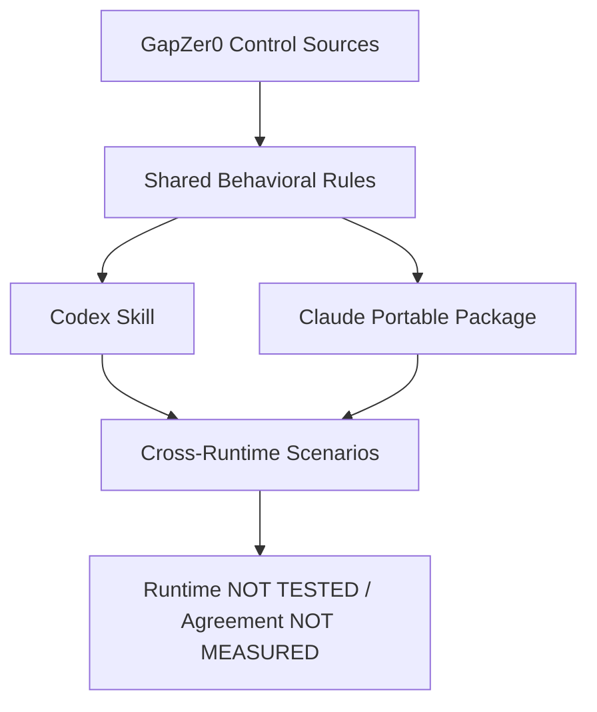

# GapZer0 Claude Port Validation

## 1. Executive Summary

2026-10-07 기준 Claude용 **portable package** 구조 포팅을 완료했다. 공식 Claude 문서 접근이 HTTP 403으로 차단되어 공식 설치 구조와 자동 발견 방식은 확인하지 못했다. `claude` 실행기가 없어 Claude 실행 검증은 하지 않았다. 설치 완료 또는 런타임 호환성 인증으로 해석하지 않는다.

| 항목 | 결과 |
|---|---|
| Porting | COMPLETE — portable package |
| Static Validation | PASS |
| Reference files byte equality | 32/32 |
| Control source files | 28 |
| Index records / unique Controls | 121 / 121 |
| Original specifications byte equality | 2/2 |
| Existing files integrity | 90/90 unchanged |
| Scenario definitions | 3 |
| Claude Runtime Validation | NOT TESTED |
| Paired Codex Runtime Validation | NOT TESTED |
| Cross-Runtime Agreement | NOT MEASURED |

정적 검증 수치는 파일·경로·메타데이터 검증 결과이며, AI 응답 품질이나 Control 충족률이 아니다.

## 2. Porting Scope

새 파일은 `claude-skill/`에만 작성했다. 기존 `.codex/skills/gapzero-guide/`, `skill/`, Control 원문, Index, 검색 품질 보고서, E03 보고서는 변경하지 않았다. 작업 시작 시 이미 수정되어 있던 `skill/scripts/test-control-search.mjs`도 그대로 보존하고 포팅 커밋에서 제외했다.

`FUNCTION_SPEC.md`와 `INTEGRATION_SPEC.md`는 원본 그대로 복사했다. 문서 안의 기존 `skill/` 경로는 저장소의 canonical 경로이며 Claude 설치 경로를 뜻하지 않는다. 공식 설치 위치를 추정해 `.claude/` 구조나 CLI 명령을 만들지 않았다.

## 3. Architecture



```text
Source preservation       [PASS]
Portable package          [COMPLETE]
Static validation         [PASS]
Claude runtime            [NOT TESTED]
Cross-runtime agreement   [NOT MEASURED]
```

## 4. Codex → Claude Mapping

| 구성요소 | Codex / canonical 경로 | 역할 | Claude 필요 여부 | 포팅 방식 | 변경 |
|---|---|---|---|---|---|
| Skill entry | `.codex/skills/gapzero-guide/SKILL.md`, `skill/SKILL.md` | 3가지 기능 및 9단계 절차 | 필요 | `claude-skill/SKILL.md` | 원본 전체 보존 후 portable 경계 안내 추가 |
| Function contract | `skill/FUNCTION_SPEC.md` | 안내·이행계획·문서초안 계약 | 필요 | 동일 이름 byte copy | 없음 |
| Integration contract | `skill/INTEGRATION_SPEC.md` | 런타임 연결 계약 | 필요 | 동일 이름 byte copy | 없음; 과거 경로 의미 README 설명 |
| Overview | `.codex/skills/gapzero-guide/references/framework-overview.md` | 구조·해석 기준 | 필요 | `references/` byte copy | 없음 |
| Control Index | `.codex/skills/gapzero-guide/references/control-index.md` | 후보 검색 | 필요 | 동일 상대 경로 byte copy | 없음 |
| Schema / formats | `skill/references/control-index-schema.md`, `output-formats.md` | 필드·출력 계약 | 필요 | 동일 상대 경로 byte copy | 없음 |
| Control originals | `.codex/skills/gapzero-guide/references/controls/` | 실제 요구사항 | 필요 | 28개 원문 byte copy | 없음 |
| Existing tests | `skill/tests/` | 기존 검증 기록 | 참조 필요 | 기존 파일 링크; 별도 paired 시나리오 작성 | 원본 변경 없음 |
| Search evaluator | `skill/scripts/test-control-search.mjs` | 기존 정량 검색 평가 | 설치 필수 아님 | 복사하지 않음 | 없음 |

32개 참조 파일은 canonical과 Codex 두 원본 모두에 대해 byte equality를 확인했다. 원문 우선순위는 유지하지만 최신 승인본 여부 자체를 새롭게 인증한 것은 아니다.

## 5. Safety Rule Preservation

| 행동 규칙 | 보존 근거 | 검증 범위 |
|---|---|---|
| Index에서 후보 검색 후 실제 Control 읽기 | 원본 SKILL 전체 prefix 보존 | 정적 PASS; 실행 NOT TESTED |
| 실제 원문 우선, overview/index 보조 | 원본 지침 및 refs byte equality | 정적 PASS |
| 가상 Control / 원문 없는 요구사항 금지 | 원본 금지규칙 보존 | 정적 PASS |
| 법적 의무·인증 보장 임의 확정 금지 | 원본 금지규칙 보존 | 정적 PASS |
| 조직 부서·주기·기한·수치·승인 기준 추정 금지 | 원본 금지규칙 보존 | 정적 PASS |
| Evidence 예시를 확보된 증적으로 표현 금지 | 원본 금지규칙 보존 | 정적 PASS |
| `[가이드라인 근거]` / `[AI 제안]` 구분 | 원본 출력 규칙 보존 | 정적 PASS |
| `[확인 필요]` / `[조직 결정 필요]` 표시 | 원본 불확실성 규칙 보존 | 정적 PASS |

정적 보존만으로 모델의 실제 준수 여부를 PASS 처리하지 않았다.

## 6. Test Scenarios

상세 입력, 실행 절차, 판정 기준은 [cross-runtime-scenarios.md](cross-runtime-scenarios.md)에 기록했다. 후보 ID는 리뷰용이며 사용자 입력에 정답으로 주입하지 않는다.

| ID | 요청 | 원문 확인 후보 | 실행 상태 |
|---|---|---|---|
| C01 | 퇴사자 계정·접근권한 처리 안내 | HRS-C-01, IAM-C-01, IAM-C-03 | 양쪽 NOT TESTED |
| C02 | CON-C-01 조직 이행계획 | CON-C-01 | 양쪽 NOT TESTED |
| C03 | 클라우드·외주 공급자 도입 검토 절차 | SUP-C-06, SUP-C-05 | 양쪽 NOT TESTED |

Control 후보는 전체 관련 Control의 배타적 정답 목록이 아니다. 8개 평가 항목은 Valid Control ID, Expected Control Relevance, Source Grounding, Required Output Structure, Unsupported Requirement, Unsupported Numeric Requirement, Unsupported Certification Judgment, Uncertainty Marking이다. 각 런타임·시나리오 조합의 8개 항목을 모두 NOT TESTED로 기록했다.

## 7. Quantitative Results

실행 명령: `PYTHONDONTWRITEBYTECODE=1 python claude-skill/tests/validate_port.py`

종료 코드: **0**. 원본 복사 파일의 CRLF 및 Markdown 줄바꿈용 공백은 byte equality 보존을 위해 유지했다. 전체 `git diff --cached --check`는 이 기존 공백에 대해 경고하므로 통과로 보고하지 않는다. 신규 작성 문서는 별도로 공백 검사를 수행했다. 실제 결과: [static-validation-results.json](static-validation-results.json). 복사 시점 해시: [source-manifest.json](source-manifest.json).

| 정적 검증 | 결과 |
|---|---|
| 참조 파일 SHA-256 및 byte equality | 32/32 PASS |
| Control 원문 파일 | 28개 확인 |
| Index ID·이름·Domain·Class·원문 경로·anchor | 121/121 PASS |
| 중복 Control ID | 0 |
| 시나리오 후보 ID 존재 | 6/6 PASS |
| 기능/통합 명세 byte equality | 2/2 PASS |
| SKILL 원본 전체 prefix 보존 | PASS |
| Codex 참조 파일 parity | PASS |
| 기존 보호 파일 SHA-256 유지 | 90/90 PASS |

| 런타임 측정 | Codex | Claude |
|---|---|---|
| 이번 paired 실행 수 | 0 | 0 |
| PASS / FAIL | 0 / 0 | 0 / 0 |
| NOT TESTED 시나리오 | 3 | 3 |
| Runtime pass rate | N/A — 실행 분모 0 | N/A — 실행 분모 0 |
| Cross-runtime agreement | NOT MEASURED | NOT MEASURED |

기존 Codex 실행 기록은 보존했지만 이번 3개 paired 시나리오의 실제 출력으로 대체하거나 재사용하지 않았다. 100% 런타임 성공 또는 런타임 간 동일 응답을 주장하지 않는다.

## 8. Cross-Runtime Comparison

| 항목 | Codex | Claude portable | 차이 / 상태 |
|---|---|---|---|
| Entry | `.codex/skills/gapzero-guide/SKILL.md` | `claude-skill/SKILL.md` | 공식 Claude discovery NOT VERIFIED |
| Reference loading | Codex skill 상대 경로 | portable 상대 경로 | 내용 동일; Claude 읽기 실행 NOT TESTED |
| Search | index 기반 후보 검색 | 동일 행동 지침 | 검색 구현 런타임 차이 NOT MEASURED |
| Source verification | 실제 Control 읽기 | 동일 요구 | Claude 실제 trace NOT TESTED |
| Output | 원본 formats / specs | 동일 복사본 | 출력 일치 NOT MEASURED |
| Uncertainty | 확인 필요 / 조직 결정 필요 | 동일 보존 | 정적 PASS |
| Safety | 원문 기반 금지규칙 | 동일 보존 | 실행 준수 NOT TESTED |
| Invocation | 기존 Codex skill entry | 수동 파일 접근 가능한 환경용 안내 | Claude 공식 호출 명령 미제공 |
| Testing | 기존 기록 + 신규 paired 시나리오 | 신규 정적 validator + paired 시나리오 | 기존 결과와 이번 결과 분리 |

## 9. Verified / Not Verified

**VERIFIED:** portable 파일 생성, 원문/Index/참조 무변경 복사, 121개 메타데이터·경로 검사, 규칙·명세 보존, 3개 시나리오 정의, 기존 90개 파일 무변경.

**NOT VERIFIED:** 공식 Claude 패키징·설치·자동 발견, Claude 파일 도구 사용, 실제 응답, 이번 Codex paired 실행, 양쪽 응답의 품질·일치도, Claude의 안전규칙 실행 준수.

## 10. Limitations

공식 문서 두 주소(`https://code.claude.com/docs/en/skills`, `https://platform.claude.com/docs/en/agents-and-tools/agent-skills/overview`)가 현재 환경에서 HTTP 403이었다. `claude` 실행기도 없다. 따라서 portable fallback을 사용했다. 문서 접근 제한을 Claude가 Skill을 지원하지 않는다는 결론으로 해석하지 않는다.

복사본은 자동 동기화되지 않는다. canonical이 변경되면 manifest 검증을 다시 수행하고 의도적인 동기화 검토가 필요하다. 최신 승인 원문이라는 외부 승인 사실을 검증하지 않았다. 파일 내용을 읽을 수 없는 실행 환경에서는 원문 확인 완료를 주장할 수 없다.

## 11. Final Status

- Porting Status: **COMPLETE — portable package**
- Static Validation: **PASS**
- Claude Runtime Validation: **NOT TESTED**
- Cross-Runtime Agreement: **NOT MEASURED**
- Existing Codex Skill / Control sources / Index / prior reports: **UNCHANGED**

The Claude port does not replace the Codex Skill.
Both ports use the same GapZer0 Control sources and behavioral rules.
