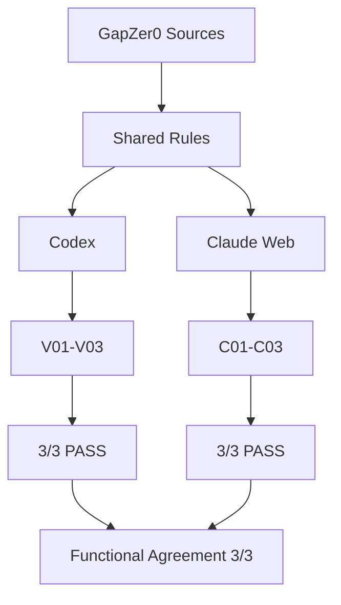

# GapZer0 Claude Port Validation

## 1. Executive Summary

**실제 Claude Runtime 대표 시나리오 검증 완료.** Claude 웹 Skills에 `gapzero-guide` v1(41개 구성 파일)을 업로드·활성화한 뒤 실행한 C01–C03이 3/3 PASS였다. 기존 Codex V01–V03도 3/3 PASS이며 세 대표 기능의 Functional Agreement는 3/3 = 100%다.

문서 업데이트일: **2026-10-08 (Asia/Seoul)**. Claude 결과의 근거는 사용자가 제공한 실제 웹 설치·실행 결과 요약이다. 이 환경에서 Claude를 재실행하거나 웹 화면을 직접 열어 확인한 결과가 아니다. 사용자가 실제 실행 날짜·모델 버전·원본 응답 전문·파일 읽기 trace를 제공하지 않아 해당 항목은 확인 필요로 남긴다.

| KPI | 현재 결과 | 범위 / 근거 |
|---|---|---|
| Porting Status | COMPLETE | 독립 Claude package |
| Claude Web Skill Upload | PASS | 사용자 실제 설치 기록 |
| Claude Skill Activation | PASS | 사용자 실제 활성화 기록 |
| Static Validation | PASS | 원문·Index·행동 규칙 보존 검사 |
| Claude Runtime Validation | 3/3 PASS | C01–C03 |
| Runtime Scenario Pass Rate | 100% | 선정한 대표 시나리오 3건 |
| Source Grounded Scenarios | 3/3 = 100% | 사용자 검증 기록 |
| Codex representative functions | 3/3 PASS | 기존 V01–V03 보고서 |
| Cross-Runtime Functional Agreement | 3/3 = 100% | 기능별 핵심 기대 동작 |

**100%는 전체 질의 정확도나 Control 충족률이 아니다.** 두 런타임의 문장 동일성 또는 동일 입력 paired 재실행의 일치율을 측정한 것이 아니다.

## 2. Porting Scope and Timeline

| 과정 | 확인 내용 |
|---|---|
| 초기 포팅 (기존 기록: 2026-10-07) | 공식 문서 두 주소의 HTTP 403, 로컬 `claude` 실행기 없음. Portable package 생성 및 정적 검증 완료. 당시 Runtime NOT TESTED / agreement NOT MEASURED |
| 업로드 준비 | name/description YAML metadata 확인·설명 갱신, 최상위 SKILL.md를 포함하는 ZIP 생성; 행동 규칙 보존 |
| 이후 실제 Claude 웹 설치·검증 (이번 사용자 제공 기록) | 업로드·활성화 성공, v1 / 41개 구성 파일, C01–C03 3/3 PASS |
| 이번 문서화 | 두 문서만 업데이트. Control source, Index, Codex Skill, Claude Skill 행동 규칙 변경 없음 |

초기 portable package 작성 시에는 미검증이었으나, 이후 Claude 웹 Skills 기능을 통해 실제 업로드 및 활성화에 성공했다. 초기 공식 문서 접근 실패 기록은 이력을 설명하며 현재 설치 실패를 뜻하지 않는다. Claude CLI나 모든 배포 방식의 호환성은 이 웹 설치 결과로 확정하지 않는다.

## 3. Architecture



```text
Initial portable package → Static PASS → Web upload PASS → Activation PASS
                                                        → C01–C03 3/3 PASS
Codex V01–V03 3/3 PASS + Claude C01–C03 3/3 PASS → Functional Agreement 3/3
```

## 4. Codex → Claude Mapping


| 구성요소 | Codex / canonical 경로 | 역할 | Claude 필요 여부 | 포팅 방식 | 변경 |
|---|---|---|---|---|---|
| Skill entry | `.codex/skills/gapzero-guide/SKILL.md`, `skill/SKILL.md` | 3가지 기능 및 9단계 절차 | 필요 | `claude-skill/SKILL.md` | 원본 행동 규칙 보존; 업로드용 name/description metadata |
| Function contract | `skill/FUNCTION_SPEC.md` | 안내·이행계획·문서초안 계약 | 필요 | 동일 이름 byte copy | 없음 |
| Integration contract | `skill/INTEGRATION_SPEC.md` | 런타임 연결 계약 | 필요 | 동일 이름 byte copy | 없음; 과거 경로 의미 README 설명 |
| Overview | `.codex/skills/gapzero-guide/references/framework-overview.md` | 구조·해석 기준 | 필요 | `references/` byte copy | 없음 |
| Control Index | `.codex/skills/gapzero-guide/references/control-index.md` | 후보 검색 | 필요 | 동일 상대 경로 byte copy | 없음 |
| Schema / formats | `skill/references/control-index-schema.md`, `output-formats.md` | 필드·출력 계약 | 필요 | 동일 상대 경로 byte copy | 없음 |
| Control originals | `.codex/skills/gapzero-guide/references/controls/` | 실제 요구사항 | 필요 | 28개 원문 byte copy | 없음 |
| Existing tests | `skill/tests/` | 기존 검증 기록 | 참조 필요 | 기존 파일 링크; 별도 paired 시나리오 작성 | 원본 변경 없음 |
| Search evaluator | `skill/scripts/test-control-search.mjs` | 기존 정량 검색 평가 | 설치 필수 아님 | 복사하지 않음 | 없음 |

32개 참조 파일은 canonical과 Codex 두 원본 모두에 대해 byte equality를 확인했다. 원문 우선순위는 유지하지만 최신 승인본 여부 자체를 새롭게 인증한 것은 아니다.

## 5. Safety Rule Preservation

원본 행동 규칙은 수정하지 않았다. 원문 우선순위, Index 후보 검색 후 실제 Control 확인, 가상 Control·근거 없는 의무·수치·인증 판단 금지, Evidence 예시와 확보 증적 구분, `[가이드라인 근거]` / `[AI 제안]` / `[확인 필요]` / `[조직 결정 필요]` 표시를 유지한다.

정적 보존 검증과 Runtime 동작 검증은 구분한다. 사용자 기록상 C01–C03에서 가상 Control ID, 임의 수치, 근거 없는 인증 판단은 각각 0건 관찰됐다. 이는 모든 향후 응답에서 오류가 없음을 보장하지 않는다.

## 6. Actual Claude Web Installation

| 항목 | 실제 설치 결과 (사용자 제공) |
|---|---|
| Platform | Claude 웹 Skills |
| Skill name | gapzero-guide |
| Skill version | v1 |
| Package files | 41 |
| Upload | PASS |
| Activation | PASS |
| 인식된 구조 | SKILL.md, references/, references/controls/, tests/, 기타 package files |

업로드 성공은 확인됐지만 보안 스캔의 상세 리포트나 개별 검사 결과는 제공되지 않았다. 별도의 스캔 성공 수치·인증을 만들지 않는다.

## 7. Actual Runtime Validation

근거: 사용자가 Claude 웹에서 실제 Skill을 활성화하여 실행한 결과 요약. 아래 PASS는 그 기록을 문서화한 것이며 이 작업에서 추가 Runtime 테스트는 실행하지 않았다. 평가 기준은 [cross-runtime-scenarios.md](cross-runtime-scenarios.md)의 8개 항목을 따른다. 해당 파일의 NOT TESTED 표는 초기 포팅 시점 기록이며 현재 결과는 이 보고서를 따른다.

### C01 Result — Control 안내

질의:

> 직원이 퇴사하면 계정과 접근권한을 바로 회수하고 싶어. 어떤 GapZer0 통제를 확인해야 해?

핵심 Control: IAM-C-01, IAM-C-03, HRS-C-01. 조건부 Control: PHY-C-02.

| Control | 실제 제시된 source |
|---|---|
| IAM-C-01 | [신원 및 자격증명의 발급·변경·회수 관리](../references/controls/05-identity-access-management/common.md#iam-c-01) |
| IAM-C-03 | [접근권한의 부여·검토·회수와 최소권한·직무분리](../references/controls/05-identity-access-management/common.md#iam-c-03) |
| HRS-C-01 | [인사 전 주기에 사이버보안 통합](../references/controls/04-human-resource-security/common.md#hrs-c-01) |
| PHY-C-02 | [위험 기반 물리적 접근 통제를 통한 자산의 비인가 접촉 방지](../references/controls/10-physical-security/common.md#phy-c-02) |

사용자가 제공한 항목별 판정:

| Metric | 결과 |
|---|---|
| Valid Control ID | PASS |
| Expected Control Relevance | PASS |
| Source Grounding | PASS |
| Required Output Structure | PASS |
| Unsupported Requirement | PASS |
| Unsupported Numeric Requirement | PASS |
| Unsupported Certification Judgment | PASS |
| Uncertainty Marking | PASS |

**C01 = PASS.** Source Grounding은 사용자 검증 기록상 PASS이며 이 작업에서 원본 파일 읽기 trace를 독립 재검증한 것은 아니다.

### C02 Result — 이행계획

> CON-C-01을 우리 조직에 적용하기 위한 이행계획을 만들어줘.

[CON-C-01 실제 source](../references/controls/03-continuity/common.md#con-c-01) 확인 성공. 목표, 실행 활동, Owner, Stakeholders, Timing, Evidence, 확인 필요, 조직 결정 필요, AI 제안, Source를 포함했다.

백업 주기, 보유기간, RTO, RPO, 복구시험 주기, 부서명, 완료기한을 임의 생성하지 않고 `[조직 결정 필요]`로 남겼다. **C02 = PASS.** C02의 8개 항목별 원본 채점표는 별도로 제공되지 않았으므로 시나리오 PASS와 확인된 관찰을 기록하고 세부 판정을 새로 만들지 않는다.

### C03 Result — 실무 문서 초안

> 클라우드 외주 공급자를 도입하기 전에 사용할 공급자 보안 검토 절차 초안을 작성해줘.

사용자가 Control ID를 제공하지 않았지만 Supplier 관련 실제 Control을 검색하고 원문 경로를 제시했다.

| 주요 Control | 원문 위치 |
|---|---|
| SUP-C-06 | [common.md#sup-c-06](../references/controls/13-supplier-relationships-security/common.md#sup-c-06) |
| SUP-E-05 | [enhancement.md#sup-e-05](../references/controls/13-supplier-relationships-security/enhancement.md#sup-e-05) |
| SUP-E-02 | [enhancement.md#sup-e-02](../references/controls/13-supplier-relationships-security/enhancement.md#sup-e-02) |
| SUP-C-02 | [common.md#sup-c-02](../references/controls/13-supplier-relationships-security/common.md#sup-c-02) |
| SUP-C-05 | [common.md#sup-c-05](../references/controls/13-supplier-relationships-security/common.md#sup-c-05) |
| SUP-C-04 | [common.md#sup-c-04](../references/controls/13-supplier-relationships-security/common.md#sup-c-04) |
| SUP-C-07 | [common.md#sup-c-07](../references/controls/13-supplier-relationships-security/common.md#sup-c-07) |
| SUP-C-03 | [common.md#sup-c-03](../references/controls/13-supplier-relationships-security/common.md#sup-c-03) |
| SUP-C-08 | [common.md#sup-c-08](../references/controls/13-supplier-relationships-security/common.md#sup-c-08) |

목적, 적용범위, 역할, 업무 절차, Evidence, 검토 및 개선, 관련 Control, 확인 필요, 조직 결정 필요를 포함했다. `[가이드라인 근거]`, `[AI 제안]`, `[확인 필요]`, `[조직 결정 필요]`를 구분했다.

SLA 시간, Critical Supplier 기준 수치, 위험등급 기준, 보관기간, 재평가 주기를 임의 확정하지 않았다. **C03 = PASS.** C03의 항목별 원본 채점표도 별도 제공되지 않았다. 위 원문 경로는 현재 저장소 Index와 원문 ID 존재 여부를 대조했으며 응답 전문의 모든 설명을 독립 재평가한 결과는 아니다.

## 8. Quantitative Runtime Metrics

| Metric | 결과 | 계산 / 범위 |
|---|---|---|
| Total | 3 | C01–C03 |
| PASS | 3 | 사용자 실제 실행 결과 |
| FAIL | 0 | 동일 테스트셋 |
| Scenario Pass Rate | 100% | 3 / 3 × 100 |
| Source Grounded Scenarios | 100% | 3 / 3 × 100 |
| Fake Control ID observed | 0 | 관찰 건수 |
| Unsupported numeric requirement observed | 0 | 관찰 건수 |
| Unsupported certification judgment observed | 0 | 관찰 건수 |
| Uncertainty / organization-decision marking | 3/3 | 세 시나리오 모두 |

**100%는 선정한 대표 Runtime 시나리오 3건 범위의 결과이며 Claude Skill 전체 질의에 대한 일반 정확도 100%를 의미하지 않는다.**

## 9. Static Quantitative Results


실행 명령: `PYTHONDONTWRITEBYTECODE=1 python claude-skill/tests/validate_port.py`

종료 코드: **0**. 원본 복사 파일의 CRLF 및 Markdown 줄바꿈용 공백은 byte equality 보존을 위해 유지했다. 전체 `git diff --cached --check`는 이 기존 공백에 대해 경고하므로 통과로 보고하지 않는다. 신규 작성 문서는 별도로 공백 검사를 수행했다. 실제 결과: [static-validation-results.json](static-validation-results.json). 복사 시점 해시: [source-manifest.json](source-manifest.json).

| 정적 검증 | 결과 |
|---|---|
| 참조 파일 SHA-256 및 byte equality | 32/32 PASS |
| Control 원문 파일 | 28개 확인 |
| Index ID·이름·Domain·Class·원문 경로·anchor | 121/121 PASS |
| 중복 Control ID | 0 |
| 시나리오 후보 ID 존재 | 6/6 PASS |
| 기능/통합 명세 byte equality | 2/2 PASS |
| SKILL 원본 행동 규칙 본문 보존 | PASS |
| Codex 참조 파일 parity | PASS |
| 기존 보호 파일 SHA-256 유지 | 90/90 PASS |

위 JSON은 초기 정적 실행 기록으로, `Claude Runtime NOT TESTED`와 `agreement NOT MEASURED` 값도 그 실행 당시 상태다. 현재 웹 Runtime 결과는 이 보고서의 7–8절 및 최종 상태를 따른다. 업로드 metadata 준비 이후 검증기는 전체 prefix 대신 행동 규칙 본문 보존과 YAML name/description을 검사하도록 갱신됐으며, 이번 문서 작업에서도 같은 정적 검증을 실행하여 exit 0 / PASS를 확인했다. 정적 검증기는 웹 Runtime 실행을 하지 않으므로 그 출력의 NOT TESTED / NOT MEASURED는 해당 스크립트의 검사 범위만 나타낸다.

## 10. Codex vs Claude Functional Comparison

Codex 근거: [runtime-test-results.md](../../skill/tests/runtime-test-results.md), 실행일 2026-10-06, Codex Cloud, V01–V03 3/3 PASS. 이전 계획·미실행 양식보다 이 실제 실행 보고서를 따른다.

| 대표 기능 | 기존 Codex | 실제 Claude Web | 핵심 기대 동작 충족 |
|---|---|---|---|
| Control 안내 | V01 PASS | C01 PASS | 양쪽 PASS |
| 이행계획 | V02 PASS | C02 PASS | 양쪽 PASS |
| 실무 문서 초안 | V03 PASS | C03 PASS | 양쪽 PASS |

**Cross-Runtime Functional Agreement = 3 / 3 × 100 = 100%.** 분자는 양쪽 런타임에서 핵심 기대 동작을 충족한 대표 기능 수, 분모는 비교한 세 기능 유형이다. 두 런타임의 문장 출력이 동일하다는 뜻이 아니다. 동일 입력·모델·시점의 paired 재실행을 수행한 수치가 아니며 source commit 동일성도 제공된 정보만으로 확정하지 않는다.

## 11. Verified / Not Verified

**VERIFIED (정적·파일 근거):** package 구조, 32개 참조 원문 동일성, 121개 Index 메타데이터·경로, 행동 규칙 보존. **VERIFIED (사용자 실제 웹 실행 기록):** 업로드·활성화, C01–C03 3/3 PASS, Source Grounding 3/3, 임의 수치·가상 ID·인증 판단 0건, 불확실성 구분 3/3.

**NOT VERIFIED:** 모든 121 Control의 exhaustive Runtime 실행, 모든 질의 정확도, 모델·버전 간 변화, 장기 안정성, Claude CLI 및 모든 배포 방식, 양쪽 텍스트 동일성, 동일 입력 paired 실행, 웹 보안 스캔 상세 결과, 응답 전문 및 trace 독립 재검토.

## 12. Limitations

- Claude Runtime 평가는 대표 시나리오 3건 기준이다.
- 전체 121 Control에 대한 exhaustive Runtime test가 아니다.
- 100%는 전체 정확도가 아니다.
- Claude와 Codex의 텍스트 동일성을 측정한 것이 아니다.
- 기능적 기대 동작 충족 여부를 비교한 것이다.
- 장기 안정성 및 모델 버전 변화는 평가하지 않았다.
- 실제 웹 실행 결과는 사용자가 제공한 요약으로 문서화했다. Claude 모델명·실행 날짜·응답 전문·trace는 확인 필요다.
- 복사본은 자동 동기화되지 않으므로 canonical 변경 시 manifest를 재검증해야 한다. 외부 승인 사실을 인증하지 않았다.

## 13. Final Status

| 항목 | 현재 상태 |
|---|---|
| Porting Status | COMPLETE |
| Claude Web Skill Upload | PASS |
| Claude Skill Activation | PASS |
| Static Validation | PASS |
| Claude Runtime Validation | 3/3 PASS |
| Runtime Scenario Pass Rate | 100% — 대표 3건 |
| Cross-Runtime Functional Agreement | 3/3 = 100% — 대표 3기능 |
| Existing Control Sources / Codex Skill / Claude behavioral rules | UNCHANGED |

The Claude port does not replace the Codex Skill.
Both ports use the same GapZer0 Control sources and behavioral rules.
