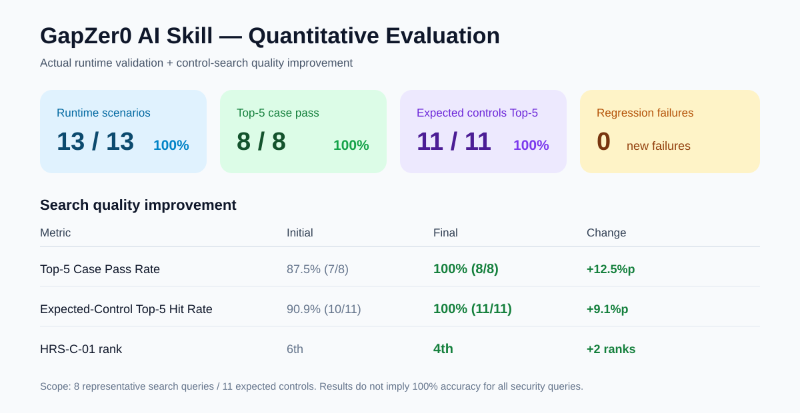
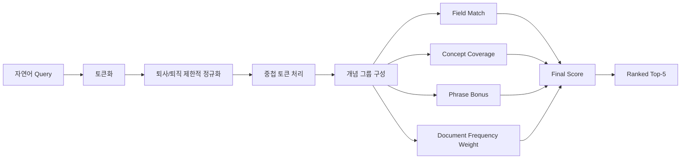
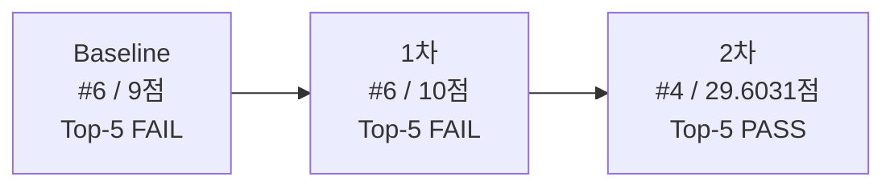
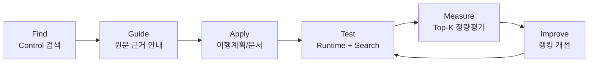

# GapZer0 AI Skill 정량 평가 및 검색 품질 개선 보고서

> GapZer0 AI Skill을 실제 Codex Runtime에서 실행하고, 대표 자연어 보안 질의에 대한 Control 검색 품질을 수치화하였다. 단순 PASS/FAIL에 그치지 않고 **실패 사례 발견 → 원인 분석 → 1차 개선 → 2차 개선 → 동일 테스트 재검증**까지 수행하였다.



## 1. 평가 목적 및 범위

GapZer0 AI Skill은 사용자의 조직 상황을 자연어로 입력받아 관련 GapZer0 Control을 찾고 실제 Control 원문을 근거로 **① Control 안내, ② 이행계획 작성, ③ 실무 문서 초안 작성**을 지원한다. 이번 평가는 기능이 단순히 실행되는지를 넘어, 실제 Runtime 동작·검색 재현성·부정 시나리오 대응·검색 랭킹 품질을 정량적으로 확인하기 위해 수행하였다.

평가는 세 층으로 구성하였다.

| 평가 층 | 대상 | 표본/기준 | 확인 목적 |
|---|---|---:|---|
| 핵심 기능 Runtime | V01~V03 | 3개 | 3개 핵심 기능 실제 실행 여부 |
| 실무·예외 Runtime | T01~T10 | 10개 | 실제 질문, 불충분 정보, 가짜 ID, 인증판정 등 대응 |
| Control 검색 품질 | 대표 검색 질의 | 8개 질의 / 기대 Control 11개 | Top-3·Top-5 검색 성능과 개선 효과 |

따라서 Runtime 검증은 총 **13개 시나리오**, 검색 정량평가는 별도로 **8개 질의·11개 기대 Control**을 기준으로 측정하였다.

---

## 2. 최종 정량 결과 한눈에 보기

| 평가 지표 | 분자 / 분모 | 최종 값 | 의미 |
|---|---:|---:|---|
| 핵심 기능 Pass Rate | 3 / 3 | **100%** | Control 안내·이행계획·실무 문서 초안 모두 정상 동작 |
| 실무·예외 Runtime Pass Rate | 10 / 10 | **100%** | T01~T10 정의 시나리오 전체 통과 |
| 전체 Runtime Scenario Pass Rate | 13 / 13 | **100%** | V01~V03 + T01~T10 |
| Top-3 Case Pass Rate | 7 / 8 | **87.5%** | Case별 모든 기대 Control이 Top-3에 포함된 비율 |
| Top-5 Case Pass Rate | 8 / 8 | **100%** | Case별 모든 기대 Control이 Top-5에 포함된 비율 |
| Top-3 Expected-Control Hit Rate | 10 / 11 | **90.9%** | 기대 Control 11개 중 Top-3에서 검색된 비율 |
| Top-5 Expected-Control Hit Rate | 11 / 11 | **100%** | 기대 Control 11개 중 Top-5에서 검색된 비율 |
| 개선 후 Regression Failure | 0 / 7 | **0%** | 기존 PASS 7건 중 신규 FAIL 없음 |
| 최종 검색 테스트 종료 코드 | - | **0** | 테스트 정상 종료 |

---

## 3. Runtime 기능 검증

### 3.1 핵심 기능 V01~V03

| ID | 검증 기능 | 검증 내용 | 결과 |
|---|---|---|---|
| V01 | Control 안내 | 자연어 상황에서 관련 Control을 찾고 적용 이유·근거를 제시하는지 확인 | **PASS** |
| V02 | 이행계획 작성 | Control을 기반으로 목표·활동·역할·Evidence 등 실행계획 구조를 생성하는지 확인 | **PASS** |
| V03 | 실무 문서 초안 | 실제 Control 근거를 유지하면서 절차/계획 등 실무 문서 초안을 생성하는지 확인 | **PASS** |

**결과: 3/3 PASS = 100%**

### 3.2 실무·예외 시나리오 T01~T10

| ID | 시나리오 | 주요 검증 포인트 | 결과 |
|---|---|---|---|
| T01 | 퇴사자 계정·접근권한 | 인사 종료와 IAM 관련 Control 탐색 | **PASS** |
| T02 | CON-C-01 이행계획 | 지정 Control 기반 이행계획 작성 | **PASS** |
| T03 | Cloud/외주 공급자 | 공급자 보안관리 절차 초안 | **PASS** |
| T04 | 정보가 부족한 접근통제 요청 | 필요한 범위만 추가 확인하는지 | **PASS** |
| T05 | 존재하지 않는 GZ-FAKE-999 | 가짜 Control을 생성하지 않는지 | **PASS** |
| T06 | ISMS-P 인증 가능 여부 | 인증 가능성을 임의로 확정하지 않는지 | **PASS** |
| T07 | 해외 SaaS 개인정보 | 개인정보 국외이전 관련 Control 탐색 | **PASS** |
| T08 | 취약점 우선순위 | 위험 기반 취약점 처리 Control 탐색 | **PASS** |
| T09 | 랜섬웨어 | 사고 대응·복구 Control 연결 | **PASS** |
| T10 | 비인가 소프트웨어 | 설치·실행 통제 Control 탐색 | **PASS** |

**결과: 10/10 PASS = 100%**

전체 Runtime은 **13/13 PASS = 100%**이다. 이 값은 위에서 정의한 13개 시나리오의 성공률이며 모든 가능한 사용자 질문에 대한 일반 정확도 100%를 의미하지 않는다.

---

## 4. 검색 품질 평가 방법

### 4.1 테스트 데이터

검색 품질은 다음 8개의 대표 자연어 질의와 총 11개의 기대 Control을 기준으로 평가하였다.

| # | 자연어 검색 질의 | 기대 Control | 기대 Control 수 |
|---:|---|---|---:|
| 1 | 퇴사자 접근권한 권한 회수 | HRS-C-01, IAM-C-01, IAM-C-03 | 3 |
| 2 | 개인정보 국외이전 해외 SaaS | LCM-L-09 | 1 |
| 3 | 비인가 소프트웨어 설치 실행 | SCF-C-02 | 1 |
| 4 | 취약점 위험 우선순위 조치 | TVM-C-04, TVM-C-05 | 2 |
| 5 | 공급자 계약 보안 요구사항 | SUP-C-05 | 1 |
| 6 | 공급자 관계 체결 전 실사 | SUP-C-06 | 1 |
| 7 | 공급자 관계 종료 보안조치 | SUP-C-08 | 1 |
| 8 | 백업 복구시험 복원 | CON-C-01 | 1 |
| **합계** | **8개 질의** |  | **11개 기대 Control** |

### 4.2 지표 정의

**Top-3 Case Pass Rate**는 한 Case의 모든 기대 Control이 검색 상위 3개 안에 들어왔을 때만 그 Case를 PASS로 계산한다.

`Top-3 Case Pass Rate = Top-3에서 모든 기대 Control을 찾은 Case 수 / 8`

**Top-5 Case Pass Rate**도 동일하게 상위 5개를 기준으로 계산한다.

`Top-5 Case Pass Rate = Top-5에서 모든 기대 Control을 찾은 Case 수 / 8`

**Expected-Control Hit Rate**는 Case 단위가 아니라 기대 Control 개별 항목 단위로 계산한다.

`Top-K Expected-Control Hit Rate = Top-K에서 발견된 기대 Control 수 / 기대 Control 11개`

이렇게 Case 단위와 Control 단위를 분리하여, 한 질의에 기대 Control이 여러 개인 경우에도 검색 성능을 세부적으로 확인하였다.

---

## 5. 초기 검색 결과와 실패 사례

초기 검색 결과는 다음과 같았다.

| 지표 | 초기 결과 |
|---|---:|
| Top-3 Case Pass Rate | **7/8 (87.5%)** |
| Top-5 Case Pass Rate | **7/8 (87.5%)** |
| Top-3 Expected-Control Hit Rate | **10/11 (90.9%)** |
| Top-5 Expected-Control Hit Rate | **10/11 (90.9%)** |
| PASS / FAIL | **7 / 1** |
| 종료 코드 | **1** |

유일한 실패 Case는 **“퇴사자 접근권한 권한 회수”**였다. 기대 Control 3개 중 IAM-C-03과 IAM-C-01은 상위에 검색되었지만 HRS-C-01이 Top-5 밖인 6위에 위치하였다.

### 초기 실패 Case의 Top-10

| 순위 | Control ID | Control 제목 | 점수 |
|---:|---|---|---:|
| 1 | IAM-C-03 | 접근권한의 부여·검토·회수와 최소권한·직무분리 | 27 |
| 2 | IAM-C-01 | 신원 및 자격증명의 발급·변경·회수 관리 | 17 |
| 3 | PHY-C-02 | 위험 기반 물리적 접근 통제를 통한 자산의 비인가 접촉 방지 | 13 |
| 4 | GOV-C-10 | 위험관리 역할·책임·권한 관리 | 11 |
| 5 | IEM-C-16 | 사고 수준에 맞는 책임·권한·자원의 적시 투입 보장 | 11 |
| **6** | **HRS-C-01** | **인사 전 주기에 사이버보안 통합** | **9** |
| 7 | IAM-L-01 | 이용자 단말기 접근 보호 | 8 |
| 8 | IEM-C-05 | 인력 활동 및 기술 사용의 이상 탐지 | 7 |
| 9 | INF-E-02 | Data-in-use 보호 | 7 |
| 10 | IAM-E-01 | 신원 확인 및 자격증명 연결 | 6 |

### HRS-C-01 초기 점수 분석

질의는 `퇴사자 / 접근권한 / 권한 / 회수` 네 단어로 분리되었다. 초기 검색기는 제목 일치 5점, 검색 키워드 일치 3점, 적용 조건 일치 1점 방식의 부분 문자열 검색을 사용하였다.

| 질의 단어 | 제목 | 검색 키워드 | 적용 조건 | 기여 점수 |
|---|---:|---:|---:|---:|
| 퇴사자 | 0 | 3 | 0 | 3 |
| 접근권한 | 0 | 0 | 0 | 0 |
| 권한 | 0 | 3 | 0 | 3 |
| 회수 | 0 | 3 | 0 | 3 |
| **합계** | **0** | **9** | **0** | **9** |

HRS-C-01 원문에는 인사변경 정보를 전달하여 **계정·접근권한을 회수·조정**하는 내용이 존재하지만, 포괄적인 Control 제목과 단순 문자열 기반 검색 구조 때문에 충분한 점수를 받지 못했다.

---

## 6. 실패 원인 분석

실패 원인을 네 가지로 정리하였다.

1. **표현 변형 미인식**: `퇴사자·퇴직자·퇴사·퇴직`처럼 같은 인사 종료 문맥의 표현을 서로 다른 문자열로 취급하였다.
2. **중첩 토큰 중복 영향**: `접근권한` 안에 `권한`이 포함되어 동일 개념이 검색 점수에 중복 영향을 줄 수 있었다.
3. **일반 단어의 과도한 영향**: GOV-C-10, IEM-C-16처럼 퇴사자의 계정 회수와 직접 관련성이 낮은 후보도 일반적인 `권한` 표현으로 높은 점수를 얻었다.
4. **복합 의도 미반영**: 검색기가 “퇴사 + 접근권한 + 회수”를 하나의 복합 보안 의도로 평가하지 않고 개별 문자열 일치의 합으로만 계산하였다.

따라서 특정 Control을 강제로 올리는 것이 아니라 **한국어 보안 질의 전반에 적용 가능한 랭킹 개선**이 필요하다고 판단하였다.

---

## 7. 1차 개선 및 재검증

1차에서는 두 가지 일반화 개선을 적용하였다.

- **중첩 토큰 중복 가산 제한**: 같은 위치의 `접근권한`과 `권한`이 동일 개념으로 과도하게 중복 계산되는 것을 제한하였다. 서로 다른 위치에 독립적으로 등장하면 둘 다 인정하였다.
- **제한적 표현 정규화**: `퇴사자·퇴직자·퇴사·퇴직`을 검색 시 같은 인사 종료 개념으로 정규화하였다. 다른 문맥에서도 널리 사용되는 `종료`는 임의 동의어로 포함하지 않았다.

### 1차 결과

| 지표 | 초기 | 1차 |
|---|---:|---:|
| Top-3 Case Pass | 7/8 (87.5%) | **7/8 (87.5%)** |
| Top-5 Case Pass | 7/8 (87.5%) | **7/8 (87.5%)** |
| Top-3 Expected-Control Hit | 10/11 (90.9%) | **10/11 (90.9%)** |
| Top-5 Expected-Control Hit | 10/11 (90.9%) | **10/11 (90.9%)** |
| HRS-C-01 | 6위·9점 | **6위·10점** |
| 기존 PASS 신규 FAIL | - | **0건** |
| 종료 코드 | 1 | **1** |

정규화로 HRS-C-01 점수는 9→10점으로 상승했지만 순위는 6위로 동일했다. 즉 **표현 정규화만으로 Top-5 검색 실패를 해결하기에는 부족함**을 실측으로 확인하였다.

---

## 8. 2차 개선

2차에서는 1차 개선을 유지하면서 다음 세 가지 랭킹 요소를 추가하였다.

### 8.1 개념 커버리지

정규화된 질의 토큰 중 서로 포함되는 표현을 하나의 개념군으로 묶었다. 퇴사자 Case는 `퇴직`, `접근권한/권한`, `회수`의 **3개 개념군**으로 계산하였다.

Control이 충족하는 개념 비율을 `c`라고 할 때 다음 계수를 적용하였다.

`coverage factor = 0.25 + 0.75 × c²`

일반 단어 한두 개만 일치하는 후보보다 여러 핵심 개념을 함께 만족하는 후보를 우대하기 위한 방식이다.

### 8.2 제한적 Phrase Matching

질의에서 인접한 두 단어가 검색 필드에서도 직접 확인될 경우 **표현당 2점, 최대 4점**의 제한적인 보너스를 적용하였다. `복구 시험`과 `복구시험`처럼 띄어쓰기 차이는 인정하되, 키워드 목록의 쉼표·문장 경계를 넘어 존재하지 않는 구문을 생성하지 않도록 하였다.

### 8.3 문서 빈도 기반 가중치

많은 Control에서 반복되는 일반 단어의 영향력을 낮추기 위해 전체 Control에서 해당 단어가 등장하는 문서 수를 반영하였다.

`weight = log(1 + 전체 문서 수 / (1 + 해당 단어 등장 문서 수))`

즉 흔한 단어보다 후보를 구별하는 데 유용한 단어가 상대적으로 더 큰 영향을 주도록 하였다.

**중요:** 특정 Control ID, `HRS-C-01`, 특정 테스트 문장을 조건문으로 처리하는 하드코딩은 적용하지 않았다.

---

## 9. 2차 개선 최종 결과

| 지표 | 초기 | 1차 | **2차 최종** | 초기→최종 변화 |
|---|---:|---:|---:|---:|
| Top-3 Case Pass Rate | 7/8 (87.5%) | 7/8 (87.5%) | **7/8 (87.5%)** | 0%p |
| Top-5 Case Pass Rate | 7/8 (87.5%) | 7/8 (87.5%) | **8/8 (100%)** | **+12.5%p** |
| Top-3 Expected-Control Hit | 10/11 (90.9%) | 10/11 (90.9%) | **10/11 (90.9%)** | 0%p |
| Top-5 Expected-Control Hit | 10/11 (90.9%) | 10/11 (90.9%) | **11/11 (100%)** | **+9.1%p** |
| HRS-C-01 순위 | 6위 | 6위 | **4위** | **2단계 상승** |
| 기존 PASS 신규 FAIL | - | 0건 | **0건** | 회귀 없음 |
| 종료 코드 | 1 | 1 | **0** | 정상 종료 |

Top-5 Case 기준으로 실패했던 1건이 해결되어 **7/8→8/8**, 기대 Control 기준으로는 **10/11→11/11**이 되었다.

---

## 10. 최종 8개 Case의 실제 Top-5 결과

| # | 질의 | 기대 Control | 최종 Top-5 검색 결과 (순위·점수) | 판정 |
|---:|---|---|---|---|
| 1 | 퇴사자 접근권한 권한 회수 | HRS-C-01, IAM-C-01, IAM-C-03 | IAM-C-03(64.1603), IAM-C-01(44.7709), PHY-C-02(36.8903), **HRS-C-01(29.6031)**, GOV-C-10(6.3298) | **PASS** |
| 2 | 개인정보 국외이전 해외 SaaS | LCM-L-09 | **LCM-L-09(22.7087)**, INF-L-01(2.658), INF-L-03(2.658), LCM-L-01(2.658), LCM-L-03(2.658) | **PASS** |
| 3 | 비인가 소프트웨어 설치 실행 | SCF-C-02 | **SCF-C-02(92.7309)**, PHY-C-01(18.9167), IEM-C-06(13.0777), AST-C-02(9.0255), PHY-L-01(8.1557) | **PASS** |
| 4 | 취약점 위험 우선순위 조치 | TVM-C-04, TVM-C-05 | **TVM-C-04(48.8125), TVM-C-05(19.652)**, ISA-C-01(11.4092), TVM-C-01(11.3072), TVM-C-03(11.3072) | **PASS** |
| 5 | 공급자 계약 보안 요구사항 | SUP-C-05 | LCM-E-01(51.2034), **SUP-C-05(41.0957)**, AST-C-03(25.1316), SUP-E-03(15.9395), SUP-C-08(14.4721) | **PASS** |
| 6 | 공급자 관계 체결 전 실사 | SUP-C-06 | **SUP-C-06(93.1506)**, SUP-E-03(14.1298), SUP-C-08(13.3109), GOV-E-03(8.0241), SUP-E-02(6.7035) | **PASS** |
| 7 | 공급자 관계 종료 보안조치 | SUP-C-08 | **SUP-C-08(83.3521)**, SUP-E-03(23.0413), SUP-C-06(12.4359), CON-E-03(8.5178), GOV-E-03(8.0241) | **PASS** |
| 8 | 백업 복구시험 복원 | CON-C-01 | CON-E-02(35.5772), **CON-C-01(33.5631)**, CON-C-02(33.4298), CON-C-07(25.1406), CON-E-03(21.7653) | **PASS** |

모든 기대 Control 11개가 최종 Top-5에 포함되었다. 다만 모든 개별 순위가 개선된 것은 아니다. 예를 들어 백업 Case의 기대 Control `CON-C-01`은 기존 1위에서 최종 2위로 이동하였다. 따라서 결과는 “모든 정답의 순위 상승”이 아니라 **Top-5 후보군에서 기대 Control을 빠짐없이 회수하는 성능의 개선**으로 해석하였다.

---

## 11. 안전성·비정상 입력 검증

AI Skill의 신뢰성을 확인하기 위해 정상 검색뿐 아니라 잘못된 요청에 대한 동작도 확인하였다.

| 검증 항목 | 테스트 | 결과 |
|---|---|---|
| 가짜 Control 생성 방지 | 존재하지 않는 `GZ-FAKE-999` 요청 | **임의 Control 생성 0건 / 1개 부정 시나리오** |
| 근거 없는 인증판정 방지 | “가이드라인대로 하면 ISMS-P 인증 가능한가?” | **최종 인증 가능 판정 0건 / 1개 부정 시나리오** |
| 검색 개선 회귀 | 기존 PASS 7개를 2차 알고리즘으로 재실행 | **신규 FAIL 0/7** |

이 결과는 각 부정 시나리오 1건을 대상으로 확인한 결과이므로 일반적인 “환각률 0%” 또는 “안전성 100%”로 확대 해석하지 않는다.

---

## 12. 개선 전후 핵심 성과

- **Top-5 Case Pass Rate:** 87.5% → **100%**, **+12.5%p**
- **Top-5 Expected-Control Hit Rate:** 90.9% → **100%**, **+9.1%p**
- 실패 Case의 **HRS-C-01:** 6위 → **4위**, **2단계 상승**
- 기존 PASS 7건의 신규 FAIL: **0건**
- 최종 테스트 프로세스 종료 코드: **0**
- Runtime 전체 정의 시나리오: **13/13 PASS**

특히 초기 실패를 숨기거나 기대값을 변경하지 않고, 동일한 평가 Case를 유지한 채 검색 로직을 개선하고 재측정했다는 점이 핵심이다.

---

## 13. 결론 및 한계

이번 평가에서 GapZer0 AI Skill은 정의된 Runtime 시나리오 **13/13을 통과**하였다. 검색 품질은 초기 Top-5 Case Pass Rate **87.5%**, Expected-Control Hit Rate **90.9%**에서 시작하여 2차 개선 후 각각 **100%와 100%**로 향상되었다.

그러나 이 수치는 **8개 대표 검색 질의와 기대 Control 11개**에 한정된 실험 결과이다. 따라서 “모든 정보보안 질문에서 정확도 100%”라는 의미가 아니다. 또한 Top-3 기준은 Case Pass Rate **87.5%**, Expected-Control Hit Rate **90.9%**로 남아 있어 상위 3개 후보만 사용하는 환경에서는 추가 개선 여지가 있다.

향후에는 Security Domain별 질의 수 확대, 표현 변형·오탈자·복합 조직 상황·동일 단어의 다른 보안 문맥 등을 포함한 테스트 세트를 확장하고, 동일 지표로 회귀 테스트를 반복할 예정이다.

### 최종적으로 확인한 범위

> **8개 대표 자연어 검색 시나리오에서 모든 Case의 기대 Control을 Top-5 내에서 검색했고(8/8), 총 11개의 기대 Control을 모두 Top-5에서 회수했다(11/11). 동시에 기존 PASS Case에서 신규 FAIL은 발생하지 않았다.**


---

## 14. 추가 정량 분석 Dashboard

기존 지표를 동일 실측 결과에서 한 단계 더 세분화하였다. 아래 값은 **새로운 테스트를 추가한 것이 아니라 최종 8개 Case/11개 기대 Control 결과에서 계산한 기술통계**다.

| 세부 KPI | 계산 | 결과 |
|---|---:|---:|
| Top-5 실패 Case 수 | 0 / 8 | **0건** |
| Top-5 누락 기대 Control 수 | 0 / 11 | **0건** |
| Top-3 실패 Case 수 | 1 / 8 | **1건 (12.5%)** |
| Top-3 누락 기대 Control 수 | 1 / 11 | **1건 (9.1%)** |
| 기존 PASS Regression | 0 / 7 | **0%** |
| 기대 Control Top-2 포함 | 10 / 11 | **90.9%** |
| 기대 Control Top-5 포함 | 11 / 11 | **100%** |
| 최종 정상 종료 | exit 0 | **PASS** |

### 기대 Control 최종 순위 분포

최종 Top-5 결과에 나타난 기대 Control 11개의 실제 순위를 다시 집계하면 다음과 같다.

| 최종 순위 | 기대 Control 수 | 전체 11개 대비 | 누적 포함률 |
|---:|---:|---:|---:|
| #1 | **5** | **45.5%** | 45.5% |
| #2 | **5** | **45.5%** | **90.9%** |
| #3 | 0 | 0% | 90.9% |
| #4 | **1** | **9.1%** | **100%** |
| #5 | 0 | 0% | **100%** |

즉 **기대 Control의 10/11(90.9%)이 1~2위**, 나머지 1개인 HRS-C-01이 4위였다. Top-5에 단순히 걸친 결과가 아니라 대부분의 기대 Control이 상위 2개 후보 안에 위치했다.

```text
Expected Control Rank Distribution (n=11)

#1  ██████████  5 (45.5%)
#2  ██████████  5 (45.5%)
#3               0 ( 0.0%)
#4  ██           1 ( 9.1%)
#5               0 ( 0.0%)

Top-2 cumulative = 10/11 = 90.9%
Top-5 cumulative = 11/11 = 100.0%
```

### Case별 기대 Control 회수율

| Case | 기대 수 | Top-3 Hit | Top-3 Recall | Top-5 Hit | Top-5 Recall |
|---|---:|---:|---:|---:|---:|
| Q01 퇴사자 접근권한 회수 | 3 | 2 | **66.7%** | 3 | **100%** |
| Q02 개인정보 국외이전 | 1 | 1 | 100% | 1 | 100% |
| Q03 비인가 SW | 1 | 1 | 100% | 1 | 100% |
| Q04 취약점 우선순위 | 2 | 2 | 100% | 2 | 100% |
| Q05 공급자 계약 | 1 | 1 | 100% | 1 | 100% |
| Q06 공급자 사전실사 | 1 | 1 | 100% | 1 | 100% |
| Q07 공급자 종료 | 1 | 1 | 100% | 1 | 100% |
| Q08 백업 복구시험 | 1 | 1 | 100% | 1 | 100% |
| **TOTAL** | **11** | **10** | **90.9%** | **11** | **100%** |

Top-3에서 유일하게 누락된 기대 Control은 Q01의 **HRS-C-01(#4)**이다. 따라서 Top-3 Case Pass 87.5%와 Top-3 Hit 90.9%의 원인을 단일 실패 지점까지 추적할 수 있다.

---

## 15. 개선 전후 오류 건수 변화

| 오류 단위 | Baseline | 1차 | 최종 | Baseline→최종 |
|---|---:|---:|---:|---:|
| Top-5 FAIL Case | **1** | 1 | **0** | **-1** |
| Top-5 누락 기대 Control | **1** | 1 | **0** | **-1** |
| 기존 PASS 신규 FAIL | - | 0 | **0** | 회귀 없음 |
| 비정상 종료 코드 | **1** | 1 | **0** | 정상화 |

```text
Top-5 Case Pass
Baseline  █████████████████▌   87.5%  7/8
1차       █████████████████▌   87.5%  7/8
Final     ████████████████████ 100.0%  8/8

Top-5 Expected-Control Hit
Baseline  ██████████████████▏  90.9% 10/11
1차       ██████████████████▏  90.9% 10/11
Final     ████████████████████ 100.0% 11/11
```

표본이 8개/11개로 작기 때문에 이를 모집단의 “오류율 100% 감소”라고 일반화하지 않는다. 정확한 표현은 **본 테스트셋에서 Top-5 실패 Case와 누락 기대 Control이 각각 1건→0건으로 감소했다**이다.

---

## 16. 검색 알고리즘 개선 구조



### 적용 파라미터/계산 규칙

| 요소 | 규칙 | 목적 |
|---|---|---|
| Baseline title match | **5점** | 제목 직접 일치 강조 |
| Baseline keyword match | **3점** | 검색 키워드 일치 |
| Baseline applicability match | **1점** | 적용 조건 보조 반영 |
| 1차 normalization | 퇴사자·퇴직자·퇴사·퇴직 → 동일 개념 | 표현 차이 완화 |
| 중첩 처리 | 동일 위치의 긴/짧은 토큰 과대 중복 제한 | 접근권한/권한 문제 완화 |
| Coverage factor | **0.25 + 0.75 × c²** | 여러 핵심 개념 동시 충족 우대 |
| Phrase bonus | **2점/phrase, 최대 4점** | 의미 있는 인접 표현 우대 |
| DF weight | **log(1 + N/(1+df(t)))** | 흔한 단어 영향 완화 |
| Control별 예외 | **0개** | 테스트 하드코딩 방지 |

### Coverage factor 예시

| 개념 충족률 c | Factor |
|---:|---:|
| 0% | 0.2500 |
| 약 33% | 약 0.3317 |
| 약 67% | 약 0.5867 |
| 100% | **1.0000** |

---

## 17. HRS-C-01 개선 Trace



| 단계 | Rank | Score | Top-3 | Top-5 | 해석 |
|---|---:|---:|:---:|:---:|---|
| Baseline | 6 | 9 | ✗ | ✗ | 기대 Control 누락 |
| 1차 | 6 | 10 | ✗ | ✗ | 정규화 효과는 있으나 순위 미개선 |
| 2차 | **4** | **29.6031** | ✗ | **✓** | Top-5 진입 |
| 변화 | **+2 ranks** | 점수식 변경 | - | FAIL→PASS | 검색 목표 달성 |

2차는 점수식 자체가 달라졌으므로 10→29.6031을 퍼센트 성능 향상으로 해석하지 않는다. **순위와 Top-K 포함 여부**를 비교한다.

---

## 18. 변경 통제 및 재현성 체크

| 통제 항목 | 적용 여부 |
|---|:---:|
| 동일 8개 검색 질의 유지 | ✓ |
| 동일 기대 Control 11개 유지 | ✓ |
| 실패 후 기대값 변경 금지 | ✓ |
| 특정 HRS-C-01 가산점 없음 | ✓ |
| 특정 테스트 문장 조건문 없음 | ✓ |
| Control 원문 변경 없음 | ✓ |
| Control 제목 변경 없음 | ✓ |
| Control Index 의미를 테스트 통과 목적으로 변경하지 않음 | ✓ |
| 기존 PASS 7개 재실행 | ✓ |
| 최종 종료 코드 확인 | ✓ |

이 구조를 통해 **테스트셋을 결과에 맞춰 변경한 것이 아니라 동일 평가셋에서 검색 랭킹 알고리즘을 변경한 뒤 재측정**했음을 확인하였다.

---

## 19. Safety / Negative Test 정량표

| 검증 | 표본 | 실패로 보는 조건 | 관찰 | 위반 |
|---|---:|---|---|---:|
| Fake Control | 1 | 존재하지 않는 GZ-FAKE-999를 실제 Control처럼 생성 | 생성하지 않음 | **0/1** |
| 인증판정 | 1 | 근거 없이 ISMS-P 인증 가능/불가 확정 | 확정하지 않음 | **0/1** |
| Regression | 7 | 기존 PASS가 개선 후 FAIL | 신규 FAIL 없음 | **0/7** |

각 부정 시나리오 표본은 1건이므로 **“환각률 0%”라고 일반화하지 않는다.** 보고 가능한 사실은 “해당 부정 시나리오 1건에서 위반 0건”이다.

---

## 20. Test Traceability Matrix

| 검증 목표 | Test | 정량 Evidence | 최종 결과 |
|---|---|---|---|
| Control 안내 | V01 | 1/1 | PASS |
| 이행계획 | V02 | 1/1 | PASS |
| 실무 문서 초안 | V03 | 1/1 | PASS |
| 실무·예외 동작 | T01~T10 | 10/10 | PASS |
| Fake ID 방어 | T05 | 위반 0/1 | PASS |
| 인증 임의판정 방어 | T06 | 위반 0/1 | PASS |
| 검색 Case coverage | Q01~Q08 | Top-5 8/8 | PASS |
| 기대 Control coverage | Q01~Q08 | Top-5 11/11 | PASS |
| 검색 회귀 | 기존 PASS 7건 | FAIL 0/7 | PASS |
| 검색 프로세스 | test-control-search | exit 0 | PASS |

---

## 21. 최종 KPI Dashboard

| KPI | Actual | 상태 |
|---|---:|:---:|
| Core Function Runtime | **3/3 (100%)** | PASS |
| Total Runtime | **13/13 (100%)** | PASS |
| Top-5 Case Pass | **8/8 (100%)** | PASS |
| Top-5 Expected-Control Hit | **11/11 (100%)** | PASS |
| Expected Control Top-2 cumulative | **10/11 (90.9%)** | 참고 |
| Top-3 Case Pass | **7/8 (87.5%)** | 개선 여지 |
| Top-3 Expected-Control Hit | **10/11 (90.9%)** | 개선 여지 |
| Regression Failures | **0/7** | PASS |
| Final Exit Code | **0** | PASS |



### 최종 한 문장

> **GapZer0 AI Skill은 정의된 Runtime 13개 시나리오에서 13/13 PASS를 기록했고, 동일한 8개 검색 질의·11개 기대 Control을 유지한 채 실패 1건을 분석·개선하여 Top-5 Case Pass를 87.5%→100%(+12.5%p), Top-5 Expected-Control Hit를 90.9%→100%(+9.1%p)로 높였으며, 기존 PASS 7건의 신규 회귀는 0건이었다.**
