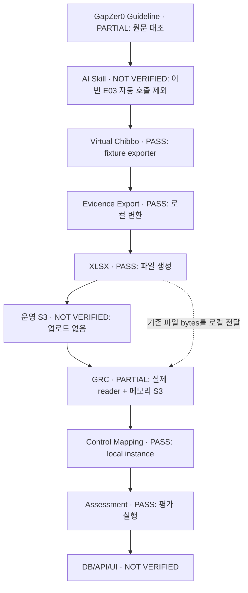
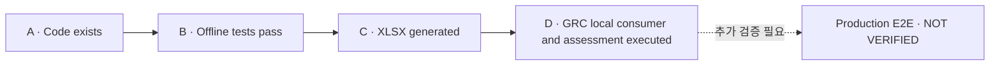
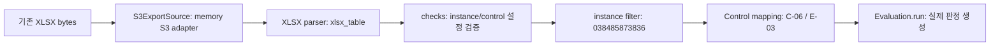

# Virtual Chibbo → GapZer0 GRC E03 E2E 검증 보고서

## 1. Executive Summary

**현재 검증 수준: D — local verification. Production E2E: NOT VERIFIED.**

Virtual Chibbo의 저장소 합성 fixture를 실제 exporter로 XLSX 파일로 만들고, GapZer0 GRC의 실제 consumer/parser에 전달하여 instance와 TVM-C-06/TVM-E-03 연결 및 평가 실행까지 확인했다. S3 전송은 메모리 대역을 사용했고, 운영 S3·DB·API·UI는 실행 검증하지 않았다. TVM-E-04도 미검증이다.

| KPI | 실제 결과 | 해석 범위 |
|---|---:|---|
| Chibbo exporter tests | **7/7 PASS** | 기존 오프라인 테스트 함수 |
| GRC S3 consumer tests | **9/9 PASS** | 기존 메모리 S3 기반 테스트 함수 |
| Evidence XLSX | **1** | 합성 fixture 기반 로컬 파일 |
| Workbook sheets | **15** | 안내 포함 |
| GRC parsed sheets | **14** | 계약 시트; 안내 제외 |
| Parsed records | **45** | 헤더·안내 행 제외 |
| Accepted records | **45** | 로컬 구조·instance 범위 검사 통과; DB 승인 아님 |
| Rejected records | **0** | 위의 수용 기준 |
| instance_id matches | **45/45** | `038485873836` |
| Parse errors | **0** | 실제 GRC parser 실행 |
| Validation errors | **0** | 구조·헤더·instance 검사; Control 규칙 위반과 별개 |
| Mapped Controls | **2** | TVM-C-06, TVM-E-03 |
| Mapped evaluation rows | **32** | 역할 데이터 24행 + 해당 역할 coverage 8행 |
| Ingestion Success Rate | **100%** | 45/45, 로컬 파싱·수용 기준 |
| Control Mapping Rate | **100%** | 평가 대상 32/32행 |

**100%는 해당 테스트셋의 파싱/연결 성공률이며 Control 충족률이 아니다.** 기본 90일 평가에서 두 Control은 `inconclusive`였다. 별도 89일 호환성 실험에서 C-06은 `failed` 메시지 16건, E-03은 `passed` 메시지 1건을 생성했다.

### 분석 대상 및 결과 출처

| 대상 | 기준 |
|---|---|
| Guideline 작업 브랜치 | `work/ai-skill-quant-eval-v2-young-eon` |
| Guideline 기준 HEAD | `1dbb7e4b0ba614ea2a86b444534a1db308adda20` |
| Virtual Chibbo | `main`, `fe3ed5de1793a94a7f2367c6a3d1d984b1985b0c` |
| GapZer0 GRC | `main`, `84300a33f6360fdedece7b8c7ae244a90a174bd4` |
| 계약 | `gapzero.tvm/v1` |
| Instance | `038485873836` — 치뽀 채용관리 플랫폼 시스템 |
| 평가 기준 시각 | fixture의 `2026-10-05T15:40:00+00:00` = 2026-10-06 00:40 KST |

검증 결과의 로컬 원본은 `/tmp/e03-offline-validation/`의 `workbook-inspection.json`, `fixture-tables.json`, `grc-consumer-result.json`이다. 이 보고서는 그 결과와 실제 실행 출력에 근거한다. 해당 파일과 XLSX는 이 문서 커밋에 포함하지 않으며, 로컬 경로는 GitHub 다운로드 링크가 아니다. fixture URL·ARN은 실제 운영 기록으로 조회·확인한 값이 아니다.

## 2. 전체 E2E Architecture



Guideline 원문과 Control의 대응은 확인했지만, AI Skill이 exporter와 GRC를 자동으로 호출하는 전체 연결은 이번 실험 대상이 아니다. 도식의 연결은 목표 구조와 실행 범위를 함께 표시한다. `Assessment PASS`는 평가 코드 실행 성공을 뜻하며 평가 내용의 통과를 뜻하지 않는다.

## 3. Verification Level

| 단계 | 정의 | 상태 |
|---|---|---|
| A | Code exists | 확인 |
| B | Offline tests pass | 확인 |
| C | Evidence XLSX generated | 확인 — 테스트용 파일 |
| D | GRC consumer/parser/control assessment executed | **확인 — 로컬 검증** |



```text
[A 확인] --> [B 확인] --> [C 확인] --> [D 확인: LOCAL]
                                         |
                                         +--> Production S3/DB/API/UI: NOT VERIFIED
```

D 판정 근거는 기존 XLSX가 실제 GRC 코드에서 읽히고 파싱된 뒤, 설정된 instance와 두 Control에 연결되어 평가 결과까지 생성된 것이다. DB 영속화·브라우저 화면까지 검증했다는 의미는 아니다.

## 4. Producer 검증

작업 디렉터리: `/tmp/Virtual_Chibbo-e2e-review`

실행한 명령:

```bash
PYTHONDONTWRITEBYTECODE=1 PYTHONPATH=scripts python -m unittest chibbo_evidence.tests.test_tvm_export -v
```

| Total | PASS | FAIL | ERROR | SKIP | Pass Rate | Exit |
|---:|---:|---:|---:|---:|---:|---:|
| 7 | 7 | 0 | 0 | 0 | 100% = 7/7 | 0 |

| 기능 | PASS/전체 | 실제 테스트 함수 |
|---|---:|---|
| Change management | 3/3 | `test_each_pull_request_runs_in_the_first_deploy_that_ships_it`, `test_people_and_stray_pipeline_calls_are_out_of_band_executions`, `test_change_records_carry_only_real_assessment_and_approval` |
| Risk acceptance | 1/1 | `test_risk_acceptances` |
| Image verification record linking | 1/1 | `test_image_deployments_intakes_and_verifications` |
| Coverage/instance | 1/1 | `test_registers_and_coverage` |
| XLSX generation | 1/1 | `test_workbook_has_every_contract_tab_with_headers` |

[Producer 테스트 원문](https://github.com/whs4-GapZer0/Virtual_Chibbo/blob/fe3ed5de1793a94a7f2367c6a3d1d984b1985b0c/scripts/chibbo_evidence/tests/test_tvm_export.py)

승인 리뷰·승인 라벨, 최초 배포 연결, CloudTrail 변경 분류, 자기승인 위험수용 제외, 이미지 도입·검증 기록 연결, coverage 및 instance 보존을 확인했다. 이미지 테스트는 보고서 fixture의 연결을 검증하며 실제 암호학적 검증을 수행하지 않는다.

## 5. Evidence XLSX 검증

로컬 파일: `/tmp/e03-offline-validation/chibbo-tvm-OFFLINE-FIXTURE.xlsx`

- 파일 존재 및 크기: **11,421 bytes**.
- Workbook: **15 sheets**.
- 안내를 제외한 계약 데이터: **45행**, `instance_id` **45/45 일치**.
- ZIP 무결성과 XML 읽기, 저장 후 원본 테이블과 재읽은 내용의 일치를 확인했다.
- 안내 시트에 `OFFLINE TEST ONLY`, 합성 fixture, 운영 Evidence 아님, 외부 읽기·업로드·GRC 운영 수신 없음이라는 설명을 넣었다.

생성 실행 명령:

```bash
PYTHONDONTWRITEBYTECODE=1 PYTHONPATH=scripts python /tmp/e03-offline-validation/generate_and_inspect.py
```

기존 `raw()`와 `build()` → `sheets()` → `xlsx.workbook()`을 사용했다. `fetch()`·`main()`·upload는 호출하지 않았고, 생성·검사 종료 코드는 0이었다.

| Sheet | 전체 행 — 헤더 포함 | 데이터 행 | instance_id 확인 |
|---|---:|---:|---|
| 안내 | 5 | 4 | 해당 없음 |
| changes | 6 | 5 | 5/5 |
| executions | 9 | 8 | 8/8 |
| exceptions | 3 | 2 | 2/2 |
| intakes | 2 | 1 | 1/1 |
| suppliers | 5 | 4 | 4/4 |
| verifications | 2 | 1 | 1/1 |
| hardware | 1 | 0 | 헤더만 존재 |
| deployments | 4 | 3 | 3/3 |
| events | 1 | 0 | 헤더만 존재 |
| cti | 1 | 0 | 헤더만 존재 |
| assets | 10 | 9 | 9/9 |
| rules | 1 | 0 | 헤더만 존재 |
| tuning | 1 | 0 | 헤더만 존재 |
| coverage | 13 | 12 | 12/12 |

빈 시트에 instance 값이 있는 레코드가 존재한다고 해석하지 않는다. 안내 데이터 4행은 45행 집계에 포함하지 않는다.

## 6. Consumer 검증

작업 디렉터리: `/tmp/GapZer0_GRC-e03-review`

실행한 명령:

```bash
PYTHONDONTWRITEBYTECODE=1 PYTHONPATH=/tmp/e03-grc-python-deps:BE python -m unittest discover -s BE/tests -p test_s3_export_source.py -v
```

| Total | PASS | FAIL | ERROR | SKIP | Exit |
|---:|---:|---:|---:|---:|---:|
| 9 | 9 | 0 | 0 | 0 | 0 |

[Consumer 테스트 원문](https://github.com/whs4-GapZer0/GapZer0_GRC/blob/84300a33f6360fdedece7b8c7ae244a90a174bd4/BE/tests/test_s3_export_source.py)

테스트는 최신 파일 선택, stale/missing/ambiguous 거부, 목록 pagination, 최신성 설정 범위, 파일 크기 제한, Drive/S3 라우팅, 기본 source 선택, prefix validation, TVM 평가 연결을 검사한다.



기존 XLSX를 사용한 추가 로컬 실행에서는 실제 `S3ExportSource`, `checks()`, `Evaluation.run()`을 호출했다. 별도로 `LocalSource` 및 공개 진입점 `tvm.collect()`도 실행했고, 미등록 instance `000000000000`은 빈 결과를 반환함을 확인했다. 이 실행은 셸의 Python heredoc과 명시적인 `PYTHONPATH=/tmp/e03-grc-python-deps:BE`를 사용했다. 별도 저장소 테스트 함수로 추가하지 않았으므로 기존 9개 테스트 수에 합산하지 않는다.

메모리 대역에서 실제 reader가 호출한 연산:

| 연산 | 요청 | 실제 AWS 여부 |
|---|---|---|
| `list_objects_v2` | `Bucket=OFFLINE-FAKE-BUCKET`, `Prefix=exports/tvm/chibbo/`, `MaxKeys=1000` | 없음 |
| `get_object` | `Key=exports/tvm/chibbo/chibbo-tvm-OFFLINE.xlsx` | 없음 |

네트워크 연결·AWS client 생성을 차단하고 DB에 연결하지 않았다. GRC 라이브러리는 `/tmp/e03-grc-python-deps`에 설치했으며 저장소 의존성 파일을 변경하지 않았다.

### 소비자 구현 및 운영 설정 경계

| 기능 | 실제 코드 | 확인 범위 |
|---|---|---|
| S3 목록·최신 파일·읽기 | `BE/gapzero/verification/connectors/s3_exports.py`: `S3ExportSource._latest`, `_read`, `table` | 실제 코드 + 대역 실행 |
| XLSX 파싱 | `BE/gapzero/verification/connectors/google_sheets.py`: `xlsx_table`, `document_table` | 실제 파일 bytes 실행 |
| instance·Control·평가 | `BE/gapzero/verification/connectors/tvm.py`: `checks`, `Evaluation`, `collect` | 로컬 실행 |
| 저장 원본·digest 재검증 | `tvm.py`: `collect_saved` | 코드만 확인 |
| Evidence와 DB Control 연결 | `BE/gapzero/verification/sheet_documents.py` | 코드만 확인 |
| 평가 결과 저장 | `BE/gapzero/verification/snapshots.py` | 코드만 확인 |
| 조회 API | `BE/gapzero/verification/service.py`, `handlers.py` | 코드만 확인 |
| UI | `FE/components/control-verification-dashboard.tsx` | 코드만 확인 |

기본 `google_sheets_targets.json`은 플랫폼 instance 이름을 `038485873836`으로 연결하지만, C-06/E-03 source는 별도의 Drive 파일이다. Chibbo `s3_prefix` source는 기본 설정에 없다. 테스트에서만 메모리 설정으로 source를 바꿨고 기본 90일 기간은 먼저 유지했다. 실제 runtime secret의 S3 설정·조직 소속·DB instance 존재는 확인하지 않았다.

## 7. Ingestion quantitative result

| 항목 | 결과 | 정의 |
|---|---:|---|
| Input XLSX | 1 | 기존 파일, 변경 없음 |
| Parsed sheets | 14 | 안내 제외 계약 시트 |
| Parsed records | 45 | 헤더 제외 |
| Accepted | 45 | 파싱·구조·instance 범위 검사 통과; DB import 아님 |
| Rejected | 0 | 위의 수용 기준 |
| instance match | 45/45 | configured instance와 일치 |
| Parse errors | 0 | GRC parser 오류 없음 |
| Validation errors | 0 | 구조·헤더·instance 오류 없음 |
| Mapped Control | 2 | C-06, E-03 |
| Mapped Evidence document | 1 XLSX → 2 Controls | 메모리 source·check 연결; DB link 저장 아님 |
| Evaluation target rows | 32 | 역할 데이터 24행 + 관련 coverage 8행 |

```text
Ingestion Success Rate = Accepted records / Parsed records × 100
                       = 45 / 45 × 100 = 100%

Control Mapping Rate = Control에 연결된 Evidence 행 / 평가 대상 Evidence 행 × 100
                     = 32 / 32 × 100 = 100%
```

평가 역할 데이터 24행은 `changes 5 + executions 8 + exceptions 2 + intakes 1 + suppliers 4 + verifications 1 + hardware 0 + deployments 3`이다. 관련 coverage는 C-06의 3개 역할과 E-03의 5개 역할, 총 8행이다.

평가 source가 읽는 9개 고유 시트에는 coverage 전체 12행이 들어 있어 입력은 36행이다. 그중 다른 역할의 coverage 4행은 두 Control의 요구 범위 밖이다. 전체 파싱 45행 중 assets 9행도 이 두 Control의 대상이 아니다. 이 13행은 rejected가 아니라 비대상이다.

`Validation errors=0`은 평가 규칙 위반이 없다는 뜻이 아니다. 기본 평가에서 coverage 관련 `inconclusive` 2건이 발생했고, 별도 실험에서 C-06 `failed` 메시지 16건을 생성했다.

## 8. Control Evidence Matrix

Generated/Parsed/Mapped는 파일·행 처리 상태이며 운영 이행 증명 여부와 다르다. Assessed에는 기본 90일과 별도 89일 실행 범위를 구분한다.

| Control | Evidence Sheet | Fields | Generated | Parsed | Mapped | Assessed | Remaining Gap |
|---|---|---|---|---|---|---|---|
| TVM-C-06 | changes | `change_id, asset_id, risk_ref, assessed_at, approver, approved_at, executed_at, result_ref` | 5행 | 확인 | C-06 | 90일 coverage 중단; 89일 누락 검사 실행 | 실제 평가 근거·승인 원본. assessed_at은 PR/issue 생성 시각 파생 |
| TVM-C-06 | executions | `execution_id, change_id, asset_id, executed_at, source_ref` | 8행 | 확인 | C-06 | 89일 변경대장·자산·시각 대조 실행 | 실제 CloudTrail·배포 원본, 사후 보안점검 |
| TVM-C-06 | exceptions | `exception_id, asset_id, risk_ref, approver, approved_at, expires_at, compensating_control, review_at, status, closure_ref` | 2행 | 확인 | C-06 | 89일 만료·재검토·종결 조건 검사 실행 | 실제 보완통제 적용·재평가 |
| TVM-C-06 | coverage | `source, period_start, period_end, collected_at, status, source_ref` | 관련 3행 | 확인 | C-06 | 90일 inconclusive; 89일 범위 검사 통과 | 운영 수집 완전성·최신성 |
| TVM-E-03 | intakes | `intake_id, kind, asset_id, supplier_id, artifact_id, inspected_at, first_used_at, inspection_ref` | 1행 | 확인 | E-03 | 89일 도입 1건 검사 | 실제 최초 사용·인수검사 원본 |
| TVM-E-03 | suppliers | `supplier_id, status, source_ref` | 4행 | 확인 | E-03 | 89일 공급자 조건 대조 | 공급경로·출처의 실질 신뢰성 |
| TVM-E-03 | verifications | `intake_id, artifact_id, verified_at, method, expected_sha256, actual_sha256, trusted_source_ref, report_ref, result, sbom_ref` | 1행 | 확인 | E-03 | 89일 signature passed 기록 연결 | 실제 서명검증 아님; SHA-256 필드는 fixture에서 빈 값 |
| TVM-E-03 | hardware | `intake_id, asset_id, serial, expected_serial, manufacturer_ref, seal_result, inspected_at, inspection_ref` | 헤더만 | 확인 | source 연결, 데이터 0 | HW 대상 없음 | HW 실물·시리얼·봉인 검증 미실행 |
| TVM-E-03 | deployments | `deployment_id, intake_id, artifact_id, deployed_at, source_ref` | 3행 | 확인 | E-03 | 89일 동일 digest·도입 관계 대조 | 실제 배포와 검증 실패 시 차단 |
| TVM-E-03 | coverage | 위 coverage 필드 | 관련 5행 | 확인 | E-03 | 90일 inconclusive; 89일 범위 검사 통과 | 운영 수집 완전성·최신성 |
| TVM-E-04 | events, cti, assets, rules, tuning | 이벤트·CTI·조직 맥락·우선순위·튜닝 필드 | assets 9행, 나머지 0 | parser 확인만 | 이번 평가 제외 | **미검증** | events 미수집, events coverage 없음, CTI/규칙/튜닝 공백 |

모든 계약 시트에는 `instance_id` 헤더가 있으며 데이터 45행이 같은 instance로 확인됐다. Coverage의 `complete`는 합성 입력의 출력값이며 Control 충족을 뜻하지 않는다.

### 실제 Control 원문

- [TVM-C-06 — 변경·예외를 위험평가로 관리·기록·추적](../references/controls/15-threat-vulnerability-management/common.md#tvm-c-06): 사전 위험평가, 승인·기간·보완통제·만료 기록, 사후 검증·추적.
- [TVM-E-03 — 도입 전 HW·SW 진위성·무결성 검증](../references/controls/15-threat-vulnerability-management/enhancement.md#tvm-e-03): 출처 확인, 해시·서명 검증, 실패 통제, 결과 기록.
- [TVM-E-04 — CTI·조직 맥락 기반 보안 이벤트 분석](../references/controls/15-threat-vulnerability-management/enhancement.md#tvm-e-04): CTI·맥락 연계, 분석·우선순위화, 개선 기록. 이번에 입증하지 않음.

## 9. 실제 평가 결과

| 조건 | TVM-C-06 | TVM-E-03 |
|---|---|---|
| Default 90-day | **inconclusive** — changes 수집 범위·최신성·완전성 확인 불가 | **inconclusive** — intakes 수집 범위·최신성·완전성 확인 불가 |
| Separate 89-day compatibility experiment | **failed observations 16** | **passed observation 1** — fixture 도입 1건, 위반 0건 |

기본 90일 설정의 결과를 보존했다. Chibbo 문서의 89일 CloudTrail 호환 평가창을 별도 메모리 `Check`에 적용했고 운영 설정·XLSX·코드는 수정하지 않았다. 현재 시각이 아닌 fixture 시각에서 판정한 재현 실험이다.

**C-06의 16개는 독립적인 취약점 16개가 아니라 평가 메시지 16건이다.** 동일 레코드에서 필수값 누락과 날짜 순서 오류가 각각 발생할 수 있다.

| 주요 검출 | fixture 레코드 | 판정 근거 |
|---|---|---|
| 승인·근거 누락 | PR-20/21/23 | approver·approved_at 등 필수 기록 및 순서 근거 누락 |
| 자산·실행 불일치 | PR-20 / RUN-1-PR20 | 변경대장의 빈 자산과 실제 실행의 A-14 불일치 |
| 변경·위험평가 근거 부족 | CT-e3, CT-e9, CT-e11 | change_id 없음, 대응 변경·위험평가 레코드 없음 |

이 결과는 **GRC가 단순히 Evidence를 읽는 것뿐 아니라 Evidence의 누락/불일치를 실제 판정했다**는 근거다. E-03의 passed도 fixture의 기록 일관성을 통과시킨 것이며, 실제 서명 수행이나 Control 전체 충족을 뜻하지 않는다.

## 10. Producer → Consumer Traceability Matrix

| Virtual Chibbo Evidence 입력 | XLSX sheet | GRC parser/평가 경로 | Control | 실제 Assessment |
|---|---|---|---|---|
| 합성 PR·리뷰·change issue | changes | `S3ExportSource.table` → `xlsx_table` → `Evaluation.changes` | C-06 | 89일 승인·근거 누락 탐지 |
| 합성 배포·커밋 조상·CloudTrail 쓰기 | executions | 같은 parser → 변경대장과 asset/time/change_id 대조 | C-06 | 불일치·미연결 실행 탐지 |
| 승인·자기승인·종결 위험수용 fixture | exceptions | 같은 parser → 예외 필수값·기간·상태 검사 | C-06 | 예외 기록 처리 실행; 자기승인 제외는 producer에서 검증 |
| 이미지 digest·검증 보고서 fixture | intakes, verifications, deployments | 같은 parser → `Evaluation.intakes` | E-03 | 89일 도입 1건 검사·passed 1건 |
| 저장소 공급자 대장 | suppliers | 같은 parser → supplier lookup | E-03 | 위 도입 검사에 사용 |
| HW 없음 | hardware | 헤더 파싱·source 연결 | E-03 | 실제 HW 대상 0건 |
| 합성 수집원·기간 | coverage | 같은 parser → `Evaluation.coverage` | C-06/E-03 | 기본 90일 inconclusive, 별도 89일 범위 통과 |
| 자산 대장·빈 CTI/이벤트/규칙/튜닝 | assets, cti, events, rules, tuning | parser만 실행 | E-04 | 평가하지 않음 |

### GRC 영속화 및 화면 경로 — 코드 확인만

`sheet_documents.py`는 instance와 catalog Control을 조회해 문서 Evidence를 연결한다. `tvm.collect_saved()`는 Evidence Version의 저장 bytes와 SHA-256을 대조해 평가한다. `snapshots.py`는 `testing.test_runs`, `testing.test_run_evidence`, `testing.live_verification_snapshots` 등에 기록한다. verification API는 저장된 `live_observations`를 제공하고 UI는 judgment·reference·summary를 표시한다. 이 경로는 이번 로컬 실행에 포함하지 않았다.

## 11. 검증된 것 / 검증되지 않은 것

| VERIFIED — 한정된 실행 범위 | 근거 |
|---|---|
| Exporter | 합성 입력 기반 7개 테스트 통과 |
| XLSX generation | 파일 실제 생성 및 재읽기 대조 |
| XLSX parsing | 실제 GRC parser로 14시트·45행 파싱 |
| Instance filtering | 설정 instance 행 선택 및 미등록 instance 음성 검사 |
| C-06/E-03 mapping | 실제 check/source 연결 |
| Assessment execution | 실제 GRC 평가 결과 생성 |

| NOT VERIFIED | 남은 확인 |
|---|---|
| Actual production S3 upload | 수행하지 않음 |
| Production S3 polling | 메모리 대역만 사용 |
| Production DB save | DB 연결·쓰기 없음 |
| collect_saved SHA-256 path | 코드만 확인 |
| Verification API runtime | API 요청 미실행 |
| Browser UI display | 브라우저 확인 미실행 |
| TVM-E-04 | 이벤트·CTI·규칙·튜닝 Evidence 부족 |
| Actual cryptographic signature verification | 보고서 fixture만 연결 |
| 실제 운영 instance의 조직 소속·Control 행 | 로컬 설정만 확인, DB 미조회 |

## 12. 최종 Pipeline

| 단계 | 상태 | 범위 |
|---|---|---|
| Chibbo → XLSX | **PASS** | 합성 fixture exporter |
| XLSX → production S3 | **NOT VERIFIED** | 업로드하지 않음 |
| S3 → GRC | **PARTIAL** | 실제 reader + 메모리 S3 대역 |
| GRC parsing | **PASS** | 실제 parser 실행 |
| Instance mapping | **PASS (local config)** | `038485873836` 필터 |
| Control mapping | **PASS** | C-06/E-03 |
| Assessment | **PASS** | 실행 성공; 규칙 판정값은 별도 |
| DB save/API/UI | **NOT VERIFIED** | 코드 확인만 |

```text
Chibbo --> XLSX --X--> Production S3
  PASS      PASS         NOT VERIFIED
             |
             +--> Memory S3 --> Actual GRC --> Instance/Control --> Assessment
                  PARTIAL         PASS           PASS(local)         PASS(execution)
                                                                        |
                                                                        X--> DB/API/UI
                                                                             NOT VERIFIED
```

### 남은 연결 작업 — 제안, 미실행

새 consumer/parser를 만드는 것보다 기존 runtime targets의 Chibbo S3 source 연결, 90일/89일 기간 계약, 테스트 DB의 Evidence Version·snapshot 저장, 저장 원본 SHA-256 경로, verification API 및 UI를 순서대로 확인해야 한다. 운영 설정·승인·원본 신뢰성은 별도로 확인해야 하며, 이 보고서 작성 중 구현·테스트를 추가하지 않았다.

## 13. 최종 결론

**Virtual Chibbo의 합성 fixture 기반 Evidence가 실제 XLSX로 생성되고, GapZer0 GRC의 실제 consumer/parser를 통해 instance와 TVM-C-06/TVM-E-03에 연결되어 평가 로직까지 실행되는 것을 로컬 환경에서 검증하였다.**

**운영 S3→DB→API→UI 전체 파이프라인은 아직 검증하지 않았다.**

현재 E03 Verification Level은 **D — local verification**이다. 파싱·연결 성공률 100%와 오프라인 테스트 통과를 Control 충족률 또는 운영 전체 E2E 성공으로 해석하지 않는다. TVM-E-04는 미검증 상태를 유지한다.
